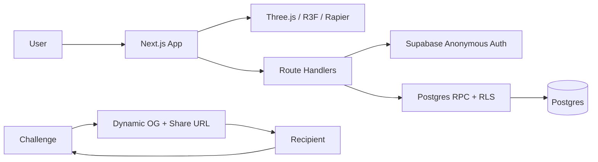

# MAKE IT WORSE

## One-Shot Codex Game Implementation Specification

**Purpose:** Hand this entire document to Codex as the sole build instruction. Codex should create the complete repository, implement the game, run the full test suite, repair all failures, and leave a production-deployable build.

**Working title:** `MAKE IT WORSE`  
**Tagline:** `Beat it. Ruin it. Send it.`  
**Core promise:** A player beats a short 3D obstacle course, adds one ridiculous trap, and sends the newly worsened version to another person. Every shared link is a playable descendant of the prior link.

---

# 0. Operating Contract for Codex

Act as the senior game engineer, product engineer, backend engineer, QA engineer, and release engineer for this repository.

Do not return a plan instead of code. Do not stop after scaffolding. Do not ask the user to choose between equivalent implementation details. Resolve ambiguity using this priority order:

1. The game must be immediately playable.
2. The complete challenge → completion → trap placement → child link → recipient loop must work.
3. The build must run without external credentials in local demo mode.
4. The same codebase must support a real Supabase-backed production deployment.
5. Mobile browser usability and performance matter more than decorative complexity.
6. Reliability matters more than adding features outside the launch scope.

Continue working until all required commands pass. When a test, type check, lint check, or build fails, diagnose and fix it rather than merely reporting it.

## Non-negotiable engineering rules

- Use TypeScript in strict mode.
- Do not use `any` except at a narrow third-party boundary that is documented inline.
- Do not leave `TODO`, `FIXME`, placeholder buttons, fake counters, mocked production responses, dead routes, or nonfunctional menus.
- Do not put secrets in client code, source files, screenshots, fixtures, or logs.
- Do not require a Supabase account merely to run and evaluate the repository.
- Do not use copyrighted characters, logos, music, sound effects, models, or textures.
- Use original procedural geometry, inline SVG, CSS, and synthesized Web Audio.
- Lock dependencies in `pnpm-lock.yaml`.
- Use the latest stable package versions that are mutually compatible at build time. Do not blindly combine incompatible major versions.
- The production target is a browser game. Do not turn this into a native app, Electron app, Unity project, or wallet product.
- The launch build is asynchronous social play. Do not implement realtime multiplayer, voice chat, an economy, tokens, NFTs, or user-uploaded levels.
- A missing optional browser capability must degrade gracefully rather than block play.
- Every API mutation must be authenticated, validated, rate constrained, and idempotent where retries are plausible.
- All database tables exposed through Supabase must have Row Level Security enabled and explicit policies.
- Do not expose a Supabase service-role key to the browser. Prefer authenticated RPC functions and RLS.

## Required final state

The repository must support:

```bash
pnpm install
pnpm dev
pnpm lint
pnpm typecheck
pnpm test
pnpm test:e2e
pnpm build
pnpm check
```

`pnpm dev` must launch a fully playable local demo even when no `.env.local` exists.

At completion, create `CODEX_BUILD_REPORT.md` containing:

- what was implemented;
- the final package versions;
- all commands run and whether they passed;
- the production setup steps;
- genuine limitations that remain, if any;
- no speculative future roadmap.

---

# 1. Product Definition

## 1.1 One-sentence pitch

**Beat a 20–45 second 3D obstacle course, add one awful trap, and send the now-worse version to a friend.**

## 1.2 Core viral loop

1. A recipient opens a challenge link.
2. The page immediately tells them who added the newest trap and what it is.
3. The recipient starts playing without creating an account.
4. They retry until they reach the exit.
5. Completion unlocks three curated trap choices.
6. They select one trap and place it in a valid location.
7. Publishing creates a new immutable child challenge with a unique URL.
8. The share screen generates personalized copy and a dynamic social preview.
9. The next recipient opens that child and repeats the process.

Sharing is not a secondary button. Publishing and sending the child challenge is the reward and continuation mechanic.

## 1.3 Launch scope

The complete launch build includes:

- a polished one-course Three.js game;
- keyboard and mobile touch controls;
- physics-based movement and eight trap types;
- retries, timing, completion, trap attribution, and challenge statistics;
- anonymous guest identity with editable display name;
- deterministic trap choices;
- a drag-and-snap trap placement editor;
- immutable parent/child challenge links;
- successful-run ghost playback;
- share attribution;
- Web Share API and clipboard fallbacks;
- dynamic page metadata and Open Graph images;
- a fresh-chain flow;
- a trending-challenges section;
- a zero-config local demo repository;
- a Supabase production repository, schema, RLS, and RPC migrations;
- unit, integration, and end-to-end tests;
- responsive UI, synthesized sound, settings, error states, and basic accessibility;
- deployment documentation.

## 1.4 Explicitly out of scope for launch

Do not add these to the one-shot build:

- synchronous multiplayer;
- networking of player transforms;
- proximity voice;
- chat or direct messaging;
- user-uploaded models, textures, sounds, or arbitrary text;
- a general-purpose level editor;
- multiple worlds or a campaign;
- a virtual currency, shop, battle pass, wallet, blockchain, NFT, or gambling mechanic;
- native mobile wrappers;
- AI-generated content inside the running game;
- a complex account system;
- friend/contact permissions;
- advertisements;
- external copyrighted meme or entertainment characters.

Leave clean extension points, but do not sacrifice the working viral loop to speculative systems.

---

# 2. User Experience Requirements

## 2.1 Opening a shared challenge

Route:

```text
/c/[challengeSlug]?s=[optionalShareToken]
```

The first meaningful screen must render quickly and say, for example:

> **Jason added a rotating toilet.**  
> 184 attempts · 12% survive  
> **Beat their version**

The page must not require registration. It may initialize an anonymous Supabase session in the background. Audio remains muted until the first user gesture.

The intro card may remain visible until the player presses the primary button. Do not create an unskippable animation.

## 2.2 Starting a fresh chain

The homepage primary button is:

> **Start a fresh chain**

It creates a root challenge with the clean base level and routes to its challenge URL. The root intro says:

> **A clean level. For now.**  
> Beat it, add the first problem, and choose your victim.

## 2.3 Attempt flow

An attempt begins when the player presses the start button or respawns after failure.

A failure occurs when:

- the player falls below the kill plane;
- the 60-second attempt timer expires;
- the player manually resets;
- a future fatal hazard explicitly emits a fatal event.

Ordinary collisions should usually knock, spin, shove, or briefly stun the player rather than instantly kill them. The comedy comes from recoverable chaos and near-falls.

On failure:

- freeze input for approximately 450 ms;
- allow the character to tumble;
- identify the most likely responsible trap;
- show a one-line result;
- allow instant retry with keyboard, touch, or a visible button;
- never reload the page.

Example:

> **Maria’s refrigerator got you.**  
> Tap to try again.

## 2.4 Completion flow

The exit is a visible glowing door sensor. On completion:

- stop the timer;
- disable movement;
- play a short synthesized fanfare;
- show the run time;
- record the successful ghost trace;
- finalize the attempt once;
- reveal the trap-selection interface.

Example:

> **YOU SURVIVED**  
> 00:27.41  
> Better than 68% of successful runs.

The percentile can be omitted until enough production data exists. Do not fabricate it in demo mode; label seeded demo statistics as demo data.

## 2.5 Trap selection and placement

The completion reward says:

> **Your reward: make it worse. Pick one.**

Show exactly three different trap cards. The choices must be deterministic for the completed attempt, persist across refreshes, and be stored with the attempt in production.

After selection:

- switch to a readable elevated editor camera;
- highlight valid placement zones;
- let the player drag or tap to position the preview;
- snap offsets to a 0.25 m grid;
- allow rotation in 90-degree increments;
- color the preview green when valid and red when invalid;
- show a concise reason when invalid;
- require one explicit `Add this trap` confirmation.

Do not require the creator to beat the child version before sharing. Server-side placement constraints protect the level’s basic geometry.

## 2.6 Publish and share

Publishing creates an immutable child challenge. Retrying the request with the same successful attempt must return the same child rather than create duplicates.

The share screen says:

> **You made it 14% worse.**  
> Your rotating toilet is now part of the chain.

Buttons:

- **Send to a friend**
- **Copy challenge link**
- **Play your version**
- **Back to home**

Preferred copy:

> I added a rotating toilet to this level. Beat it and make it worse: [URL]

Alternative copy when observed survival data exists:

> Only 12% survive this version. Your turn: [URL]

Use `navigator.share()` where supported. Fall back to the Clipboard API. If clipboard access fails, show a selectable URL field.

## 2.7 Homepage

The homepage includes:

- logo/title;
- one-sentence explanation;
- `Start a fresh chain`;
- `Play a trending disaster`;
- three to six trending challenge cards;
- a compact “How it works” strip;
- settings access;
- privacy and terms links.

Do not put the user in a metaverse lobby. The primary action must start a run within one click plus the challenge intro confirmation.

---

# 3. Required Technology Stack

Use this stack unless a package has become unavailable or demonstrably incompatible at implementation time.

## Application framework

- Next.js, latest stable, App Router
- React 19
- TypeScript, strict mode
- CSS Modules plus `app/globals.css`
- No Tailwind requirement
- Server Components for route shells and metadata
- Client Components for game/runtime UI
- Dynamically load the game canvas with SSR disabled

## 3D and physics

- `three`
- `@react-three/fiber` v9-compatible release
- `@react-three/drei`
- `@react-three/rapier` v2-compatible release
- Rapier fixed-step physics
- Original procedural meshes only

The official `@react-three/rapier` documentation states that v2 supports React Three Fiber v9 and React 19. Preserve that compatibility relationship when resolving package versions.

## State and validation

- `zustand` for coarse client game state
- `zod` for every external payload and persisted JSON shape
- React refs for high-frequency physics and animation state
- Do not push per-frame transforms through React state

## Backend

- `@supabase/supabase-js`
- Supabase anonymous authentication
- Supabase Postgres
- RLS-protected tables
- authenticated Postgres RPC functions for atomic mutations
- optional Supabase Realtime subscription only for low-frequency challenge-stat refreshes
- no service-role key in the client

## Testing

- Vitest
- React Testing Library where UI testing is useful
- Playwright for Chromium, WebKit, and Firefox smoke coverage
- a deterministic E2E test hook enabled only in test builds

## Package manager

- `pnpm`

## Avoid unnecessary dependencies

Do not add a UI component library, full game engine, animation suite, heavy model loader, analytics SaaS, or audio asset package. Build the launch experience with the named stack and browser APIs.

---

# 4. Repository Initialization and Scripts

If the repository is empty, initialize a Next.js App Router project in the current directory. Do not nest the project in an unnecessary subfolder.

Use the following package-script contract:

```json
{
  "scripts": {
    "dev": "next dev",
    "build": "next build",
    "start": "next start",
    "lint": "eslint . --max-warnings=0",
    "typecheck": "tsc --noEmit",
    "test": "vitest run",
    "test:watch": "vitest",
    "test:e2e": "playwright test",
    "test:e2e:ui": "playwright test --ui",
    "check": "pnpm lint && pnpm typecheck && pnpm test && pnpm build"
  }
}
```

Add only scripts that are real and working.

Create:

```text
.env.example
README.md
CODEX_BUILD_REPORT.md
```

`.env.example` must contain:

```bash
# The app runs in local demo mode when Supabase values are absent.
NEXT_PUBLIC_SITE_URL=http://localhost:3000

NEXT_PUBLIC_SUPABASE_URL=
NEXT_PUBLIC_SUPABASE_PUBLISHABLE_KEY=

# Optional production abuse protection for anonymous sign-in.
NEXT_PUBLIC_TURNSTILE_SITE_KEY=

# Optional build identifier shown in attempt telemetry.
NEXT_PUBLIC_BUILD_VERSION=dev
```

Do not require a service-role key for normal operation. If an administrative script genuinely needs one, put it in a separate optional variable and never import it into a client module.

---

# 5. Target File Structure

Use this structure as the architectural target. Small deviations are acceptable when they improve clarity, but do not collapse the whole game into a handful of giant files.

```text
app/
  layout.tsx
  page.tsx
  globals.css
  not-found.tsx
  error.tsx
  privacy/page.tsx
  terms/page.tsx
  c/[slug]/
    page.tsx
    loading.tsx
    opengraph-image.tsx
  api/
    health/route.ts
    chains/route.ts
    challenges/[slug]/route.ts
    attempts/start/route.ts
    attempts/finish/route.ts
    challenges/publish-child/route.ts
    shares/route.ts
    shares/open/route.ts
    profile/route.ts

components/
  home/
    HomePageClient.tsx
    TrendingChallengeCard.tsx
    HowItWorks.tsx
  game/
    GameClient.tsx
    GameCanvas.tsx
    GameScene.tsx
    LevelGeometry.tsx
    Lighting.tsx
    CameraRig.tsx
    PlayerController.tsx
    PlayerVisual.tsx
    ExitDoor.tsx
    KillPlane.tsx
    GhostRunner.tsx
    TrapRenderer.tsx
    DebugOverlay.tsx
    traps/
      SwingingHammer.tsx
      RollingFridge.tsx
      FloorFan.tsx
      SoapSlick.tsx
      SpringPad.tsx
      AngryVacuum.tsx
      RotatingToilet.tsx
      GiantBeachBall.tsx
    placement/
      PlacementEditor.tsx
      PlacementZones.tsx
      TrapPreview.tsx
  hud/
    ChallengeIntro.tsx
    GameHud.tsx
    FailureCard.tsx
    FinishCard.tsx
    TrapChoicePanel.tsx
    SharePanel.tsx
    MobileControls.tsx
    SettingsPanel.tsx
    ToastRegion.tsx
  icons/
    TrapIcon.tsx
    InlineIcons.tsx

lib/
  api/
    auth.ts
    errors.ts
    fetch-json.ts
    rate-limit.ts
  auth/
    guest.ts
    names.ts
    profanity.ts
  game/
    constants.ts
    types.ts
    schemas.ts
    state-machine.ts
    seed.ts
    level-definition.ts
    placement.ts
    trap-catalog.ts
    trap-choice.ts
    difficulty.ts
    collision-groups.ts
    replay-codec.ts
    share-copy.ts
    device-quality.ts
  repository/
    Repository.ts
    createRepository.ts
    DemoRepository.ts
    SupabaseRepository.ts
    demo-db.ts
  supabase/
    browser.ts
    server.ts
  audio/
    AudioManager.ts
  clip/
    RollingClipRecorder.ts
  analytics/
    events.ts

stores/
  game-store.ts
  settings-store.ts

supabase/
  migrations/
    0001_extensions_types.sql
    0002_tables.sql
    0003_indexes_rls.sql
    0004_rpc_functions.sql
    0005_seed_catalog.sql
  seed.sql

tests/
  unit/
    seed.test.ts
    trap-choice.test.ts
    placement.test.ts
    replay-codec.test.ts
    difficulty.test.ts
    state-machine.test.ts
  integration/
    demo-repository.test.ts
    publish-idempotency.test.ts
  e2e/
    home.spec.ts
    challenge-loop.spec.ts
    mobile.spec.ts
    error-states.spec.ts

public/
  manifest.webmanifest
  icon.svg
  apple-icon.svg

playwright.config.ts
vitest.config.ts
eslint.config.mjs
tsconfig.json
next.config.ts
```

The game should not depend on binary assets. Procedural geometry and synthesized audio make the repository self-contained.

---

# 6. Domain Types and Runtime Schemas

Create canonical types in `lib/game/types.ts` and matching Zod schemas in `lib/game/schemas.ts`. Do not maintain divergent ad hoc versions.

Use these concepts:

```ts
export type TrapType =
  | "swinging_hammer"
  | "rolling_fridge"
  | "floor_fan"
  | "soap_slick"
  | "spring_pad"
  | "angry_vacuum"
  | "rotating_toilet"
  | "giant_beach_ball";

export type GamePhase =
  | "booting"
  | "intro"
  | "ready"
  | "playing"
  | "failed"
  | "finished"
  | "choosing_trap"
  | "placing_trap"
  | "publishing"
  | "sharing"
  | "paused"
  | "fatal_error";

export type AttemptOutcome =
  | "started"
  | "completed"
  | "fell"
  | "timeout"
  | "reset"
  | "quit";

export type DeviceClass = "desktop" | "tablet" | "mobile" | "unknown";

export type Vec3Tuple = readonly [number, number, number];

export interface TrapPlacementInput {
  type: TrapType;
  zoneId: string;
  offsetX: number;
  offsetZ: number;
  rotationQuarterTurns: 0 | 1 | 2 | 3;
}

export interface TrapInstance {
  id: string;
  type: TrapType;
  ownerUserId: string | null;
  ownerName: string;
  ownerAvatarSeed: number;
  depthAdded: number;
  zoneId: string;
  position: Vec3Tuple;
  rotationY: number;
  seed: number;
  params: Record<string, number | boolean | string>;
}

export interface GhostTrace {
  version: 1;
  hz: 15;
  durationMs: number;
  frames: number[][];
}

export interface ChallengeStats {
  attempts: number;
  completions: number;
  survivalRate: number | null;
  bestTimeMs: number | null;
  recentAttempts: number;
  shareCount: number;
}

export interface ChallengeDTO {
  id: string;
  slug: string;
  chainId: string;
  chainSlug: string;
  parentSlug: string | null;
  depth: number;
  baseSeed: number;
  levelVersion: 1;
  createdByName: string;
  createdByAvatarSeed: number;
  addedTrap: TrapInstance | null;
  traps: TrapInstance[];
  ghostTrace: GhostTrace | null;
  stats: ChallengeStats;
  createdAt: string;
  isDemo: boolean;
}

export interface AttemptStartResult {
  attemptId: string;
  offeredTraps: readonly [TrapType, TrapType, TrapType] | null;
}

export interface AttemptFinishResult {
  attemptId: string;
  outcome: Exclude<AttemptOutcome, "started">;
  offeredTraps: readonly [TrapType, TrapType, TrapType] | null;
  stats: ChallengeStats;
}

export interface PublishChildResult {
  challenge: ChallengeDTO;
  attributedShareUrl: string;
  estimatedWorsePercent: number;
}
```

Runtime validation requirements:

- reject unknown trap types;
- reject extra keys in mutation payloads where practical;
- clamp neither malformed positions nor malformed rotations silently;
- enforce display name length of 2–24 visible characters;
- enforce finite numbers;
- limit ghost traces to 900 frames;
- limit every frame to the expected integer count and value range;
- cap request JSON bodies;
- validate all database JSON before using it in the renderer.

Never trust a `traps` JSON array merely because it came from the database. Parse it.

---

# 7. Game State Machine

Implement state transitions explicitly. The Zustand store may expose actions, but transitions must be validated in `state-machine.ts`.

Required transitions:

```text
booting -> intro
intro -> ready
ready -> playing
playing -> failed
playing -> finished
playing -> paused
paused -> playing
failed -> playing
finished -> choosing_trap
choosing_trap -> placing_trap
placing_trap -> choosing_trap
placing_trap -> publishing
publishing -> sharing
publishing -> placing_trap       # recoverable error
any nonterminal -> fatal_error   # unrecoverable load/runtime error
```

Rules:

- an attempt ID must exist before the phase becomes `playing`;
- attempt finalization must happen at most once;
- completion wins over a simultaneous fall if the exit sensor was entered first in the same physics tick;
- a failed run must never unlock trap placement;
- a successful attempt’s offered trap choices must not change after refresh;
- publishing must require a successful attempt belonging to the current challenge;
- leaving the page during a running attempt may best-effort finalize as `quit`, but do not block navigation;
- pausing stops player input and the timer, but not the browser thread;
- page visibility loss may auto-pause on desktop and must not unexpectedly pause during an OS share sheet on mobile.

Keep high-frequency values such as player position, velocity, and camera targets in refs. Store coarse values such as phase, timer display, selected trap, and messages in Zustand.


# 8. Base Level Specification

## 8.1 Theme and visual premise

The course is a floating fragment of **The Worst Apartment** suspended in a bright sky. Household objects becoming hazards gives the trap catalog a coherent visual identity.

The art direction is:

- low-poly;
- toy-like;
- colorful;
- readable at mobile scale;
- deliberately silly rather than realistic;
- flat-shaded or softly shaded with high roughness;
- no external environment map;
- no texture dependency;
- strong silhouettes;
- minimal visual noise near gameplay surfaces.

Use these CSS and material color tokens as the default palette:

```css
:root {
  --ink: #171a2b;
  --cream: #fff8e8;
  --sky-top: #79d5ff;
  --sky-bottom: #d8f5ff;
  --yellow: #ffd84d;
  --red: #ff5c65;
  --green: #57dfa1;
  --purple: #8b72ff;
  --blue: #4b8dff;
  --orange: #ff9b4a;
  --muted: #6e7487;
  --panel: rgba(255, 248, 232, 0.94);
}
```

3D materials may use these values or nearby shades. Centralize the palette rather than scattering literals.

## 8.2 Coordinate system

- `Y` is up.
- `+Z` points from spawn toward the finish.
- `X` is lateral.
- Spawn is near `Z = 1`.
- Finish is near `Z = 40`.
- Kill plane is `Y = -10`.
- The course centerline is generally `X = 0`.

## 8.3 Required base geometry

Build the level from rounded boxes, boxes, cylinders, and simple trim. Dimensions are full sizes, not half-extents.

| Piece | Center | Size | Rotation | Notes |
|---|---:|---:|---:|---|
| Start deck | `[0, -0.50, 2.50]` | `[8.0, 1.0, 5.0]` | none | Spawn surface |
| Runway | `[0, -0.50, 8.25]` | `[6.0, 1.0, 5.5]` | none | Easy opening |
| Stone A | `[-1.60, -0.35, 12.20]` | `[2.4, 0.7, 1.8]` | none | First lateral choice |
| Stone B | `[0, 0.00, 14.00]` | `[2.2, 0.7, 1.8]` | none | Slightly raised |
| Stone C | `[1.50, -0.20, 15.80]` | `[2.4, 0.7, 1.8]` | none | Leads to bridge |
| Narrow bridge | `[0, -0.45, 20.60]` | `[3.0, 0.9, 7.2]` | none | Main danger corridor |
| Left island | `[-1.75, -0.40, 27.10]` | `[2.7, 0.8, 4.8]` | none | Alternate route |
| Right island | `[1.75, -0.40, 27.10]` | `[2.7, 0.8, 4.8]` | none | Alternate route |
| Convergence deck | `[0, -0.35, 31.10]` | `[5.6, 0.7, 2.6]` | none | Paths rejoin |
| Final ramp | `[0, 0.00, 34.05]` | `[4.0, 0.6, 3.6]` | `X = -0.10 rad` | Slight ascent |
| Finish deck | `[0, 0.00, 38.10]` | `[7.0, 0.8, 6.0]` | none | Exit area |

Adjust tiny seams only when needed to prevent snagging. Preserve the overall length, progression, and placement-zone coordinates.

Add bevel-like visual trim with nested meshes if desired, but colliders should stay simple.

## 8.4 Spawn and exit

Player spawn:

```ts
export const PLAYER_SPAWN = [0, 1.25, 1.20] as const;
```

Exit:

```ts
export const EXIT_POSITION = [0, 1.50, 40.25] as const;
export const EXIT_SENSOR_SIZE = [2.20, 3.00, 0.70] as const;
```

The exit must look unmistakably like a finish door:

- cream frame;
- glowing green interior;
- pulsing emissive edge;
- floating `EXIT` label rendered as HTML or simple geometry;
- nonblocking sensor collider;
- confetti particles on completion, capped for mobile.

Keep at least 1.5 m around the exit free of trap placement.

## 8.5 Placement zones

Store the canonical zones in `level-definition.ts` and mirror them in the production database seed. The database is authoritative for publishing validation.

Each zone has:

```ts
interface PlacementZone {
  id: string;
  label: string;
  minX: number;
  maxX: number;
  minZ: number;
  maxZ: number;
  groundY: number;
  maxOccupants: number;
  allowedTypes: TrapType[];
}
```

Required zones:

| ID | X bounds | Z bounds | Ground Y | Max | Notes |
|---|---:|---:|---:|---:|---|
| `runway_front` | `[-2.3, 2.3]` | `[6.0, 7.5]` | `0.05` | 2 | Broad opening |
| `runway_mid` | `[-2.3, 2.3]` | `[7.8, 9.2]` | `0.05` | 2 | Broad opening |
| `runway_back` | `[-2.3, 2.3]` | `[9.5, 10.7]` | `0.05` | 2 | Before stones |
| `stones_front` | `[-2.4, 0.0]` | `[11.4, 13.0]` | `0.10` | 1 | Restrict large sweepers |
| `stones_mid` | `[-1.2, 1.2]` | `[13.2, 14.8]` | `0.45` | 1 | Small traps only |
| `stones_back` | `[0.0, 2.5]` | `[15.0, 16.4]` | `0.15` | 1 | Small traps only |
| `bridge_front` | `[-1.05, 1.05]` | `[17.5, 19.1]` | `0.05` | 1 | Narrow |
| `bridge_mid` | `[-1.05, 1.05]` | `[19.5, 21.1]` | `0.05` | 1 | Narrow |
| `bridge_back` | `[-1.05, 1.05]` | `[21.5, 23.4]` | `0.05` | 1 | Narrow |
| `island_left` | `[-2.75, -0.70]` | `[25.0, 29.0]` | `0.05` | 2 | Left route |
| `island_right` | `[0.70, 2.75]` | `[25.0, 29.0]` | `0.05` | 2 | Right route |
| `convergence` | `[-2.20, 2.20]` | `[30.1, 32.0]` | `0.05` | 2 | Paths rejoin |
| `ramp` | `[-1.55, 1.55]` | `[32.8, 34.6]` | `0.45` | 1 | No rolling fridge |
| `finish_front` | `[-2.60, 2.60]` | `[35.4, 37.0]` | `0.45` | 2 | Final gauntlet |
| `finish_mid` | `[-2.40, 2.40]` | `[37.3, 38.7]` | `0.45` | 1 | Keep exit clear |

Allowed-type rules:

- `stones_*`: `floor_fan`, `soap_slick`, `spring_pad`, `giant_beach_ball`
- `bridge_*`: all except `rolling_fridge` on `bridge_mid`
- `ramp`: `swinging_hammer`, `floor_fan`, `soap_slick`, `spring_pad`, `rotating_toilet`, `giant_beach_ball`
- all other zones: all trap types unless explicitly unsafe

Maximum physical trap instances per challenge: `20`.

When a challenge reaches 20 traps, completion does not open the editor. Show:

> **This disaster is complete.**  
> You survived a legendary chain.

The player can still share it or start a fresh chain. Do not add an upgrade system in launch scope.

## 8.6 Environment

Required scene elements:

- gradient sky using scene background plus CSS, a large inverted sphere shader, or a lightweight gradient plane;
- subtle exponential fog;
- hemisphere light;
- one directional key light with restrained shadows;
- soft contact-like shadow under the player where affordable;
- procedural clouds made of low-poly white spheres, placed far from collision;
- distant floating apartment fragments as noninteractive silhouettes;
- no postprocessing dependency required.

Recommended renderer settings:

- tone mapping appropriate for a bright stylized scene;
- physically correct lighting only if it does not complicate color matching;
- DPR clamped to `1.5` on desktop and `1.0–1.25` on low-end mobile;
- antialiasing enabled when quality mode permits;
- shadow map 1024 or lower;
- no large dynamic cubemaps.

---

# 9. Player Controller

## 9.1 Collider and rigid body

Use a dynamic Rapier rigid body with a capsule collider.

Starting values:

```ts
const PLAYER = {
  capsuleRadius: 0.38,
  capsuleHalfHeight: 0.55,
  mass: 1.0,
  gravityScale: 2.2,
  linearDamping: 0.45,
  angularDamping: 2.5,
  moveSpeed: 7.2,
  acceleration: 30,
  airControl: 0.35,
  jumpVelocity: 7.4,
  coyoteTimeMs: 120,
  jumpBufferMs: 150,
  maxFallSpeed: 18,
  strongImpactThreshold: 9,
  stunImpactThreshold: 14,
  fatalImpactThreshold: Number.POSITIVE_INFINITY
} as const;
```

Lock player body rotation during normal movement. On failure, unlock rotation and apply a small torque/impulse so the body tumbles before reset.

Do not make collision impacts fatal in launch scope. Falling and timeout are the normal loss conditions.

## 9.2 Movement

Desktop controls:

- `W` / Up Arrow: forward `+Z`
- `S` / Down Arrow: backward
- `A` / Left Arrow: left
- `D` / Right Arrow: right
- `Space`: jump
- `E`: grab/release a grabbable dynamic prop
- `R`: reset attempt
- `Escape`: pause
- `M`: mute toggle

Movement requirements:

- normalize diagonal input;
- accelerate toward desired horizontal velocity instead of teleporting;
- preserve vertical velocity;
- use impulses or controlled velocity changes in a physics-step hook;
- cap horizontal speed;
- reduce control in air;
- support coyote time and jump buffering;
- orient the visual character toward movement;
- do not rotate the capsule with camera yaw;
- reset all input on window blur.

Ground detection:

- use a Rapier ray or shape cast below the capsule;
- ignore the player’s own collider;
- treat surfaces with a reasonable upward normal as ground;
- avoid a React state update every physics tick.

## 9.3 Grabbing

Grabbing is intentionally limited.

Eligible objects:

- giant beach ball;
- activated rolling refrigerator;
- future dynamic props tagged `grabbable`.

Behavior:

1. Press or hold grab within approximately 1.8 m.
2. Select the nearest eligible rigid body in a forward cone.
3. Apply a spring-damper force each physics step toward a hold point in front of the player.
4. Clamp force to prevent numerical explosions.
5. Release on key/button release, excessive distance, player failure, or object despawn.
6. Do not create a persistent React component tree mutation every frame.

The feature should feel like pushing and awkwardly dragging, not precision inventory handling. If the API for a joint becomes fragile, use the spring-force method rather than dropping the feature.

## 9.4 Stumble and recovery

On a strong trap collision:

- record the responsible trap;
- reduce movement control for 250–500 ms based on impulse;
- tilt or squash the visual;
- add camera shake;
- trigger haptic feedback when permitted;
- keep the player physically recoverable.

Do not force a full ragdoll on every hit.

## 9.5 Player visual

Build an original toy-like character procedurally:

- rounded torso;
- oversized spherical head;
- two simple eyes;
- short arms and legs;
- flat-shaded materials;
- avatar color derived from `avatarSeed`;
- walk cycle driven by movement speed;
- squash on landing;
- brief surprised eye expression after impact;
- no skeletal asset.

Keep the visual group separate from the physics body. Animate limbs with sine curves and damped targets. On failure, exaggerate limb flailing while the capsule tumbles.

## 9.6 Camera

Normal play camera:

- FOV around `52`;
- target position approximately 6.2 m behind, 3.6 m above the player;
- look approximately 2.5 m ahead and 1.0 m above the player;
- exponential damping;
- lateral look-ahead based on velocity;
- obstacle-safe behavior is optional, but do not let the camera go below the floor;
- small impact shake, disabled in reduced-motion mode.

Suggested calculations:

```ts
const alpha = 1 - Math.exp(-8 * delta);
camera.position.lerp(desiredPosition, alpha);
lookTarget.lerp(desiredLookTarget, 1 - Math.exp(-10 * delta));
```

Editor camera:

- elevated three-quarter view;
- frame the selected placement zone and enough surrounding course to understand consequences;
- allow limited orbit or pan only if it remains intuitive on touch;
- a fixed damped camera that moves between zones is preferable to unrestricted orbit controls.

## 9.7 Mobile controls

Support portrait and landscape. Do not force orientation.

Required overlay:

- left thumb virtual joystick;
- right-side jump button;
- smaller grab button;
- visible reset/pause access;
- 56 px minimum primary touch target;
- safe-area insets;
- no page scroll while actively playing.

The joystick should:

- capture one pointer;
- use a circular dead zone;
- clamp magnitude;
- reset on pointer cancel;
- never steal the pointer used by jump or share UI.

The right half of the canvas may optionally allow a small camera offset drag, but the game must remain playable without manual camera control.

---

# 10. Physics and Collision Architecture

## 10.1 Fixed timestep

Use a stable fixed physics timestep near `1 / 60`. Render interpolation may remain independent.

Never seed behavior from `Math.random()` during a run. All trap parameters come from the persisted trap seed.

## 10.2 Collision groups

Centralize groups in `collision-groups.ts`.

Conceptual groups:

```ts
export const CollisionGroup = {
  WORLD: 0x0001,
  PLAYER: 0x0002,
  TRAP: 0x0004,
  DYNAMIC_PROP: 0x0008,
  SENSOR: 0x0010,
  GHOST: 0x0020
} as const;
```

Use the Rapier helper format correctly for memberships and filters. Ghosts do not collide. Editor previews do not collide.

## 10.3 Hazard attribution

Maintain:

```ts
interface HazardContact {
  trapInstanceId: string;
  trapType: TrapType;
  ownerName: string;
  contactedAtMs: number;
  impulseMagnitude: number;
}
```

On each relevant collision or force application, update the last contact when the new event is meaningful.

If the player falls within 3.5 seconds of a trap contact, attribute the failure to that trap. Otherwise attribute it to `the void`.

Do not attribute a death to a trap merely because the player brushed it much earlier.

## 10.4 Attempt reset

Resetting must restore every trap to its canonical initial state.

The simplest robust approach is to increment an `attemptSerial` and remount the physics subtree with a React `key` that includes that serial. Preserve only the immutable challenge data, UI settings, and attempt history outside the subtree.

Ensure:

- dynamic props respawn;
- kinematic phases restart deterministically from seed;
- sensors clear state;
- held-object refs clear;
- player returns to spawn;
- ghost playback restarts;
- timer resets;
- last hazard clears.

## 10.5 Trigger ordering

Use a single completion/failure arbiter for each physics tick.

Priority:

1. exit entered;
2. kill plane crossed;
3. timeout;
4. manual reset.

Once finalization begins, ignore later triggers until the next attempt.

---

# 11. Trap Catalog

Create one canonical catalog in `trap-catalog.ts`. Each entry includes:

```ts
interface TrapDefinition {
  type: TrapType;
  displayName: string;
  articleName: string;
  shortDescription: string;
  category: "sweeper" | "prop" | "movement";
  placementRadius: number;
  riskWeight: number;
  allowedZoneIds: string[];
  iconKey: string;
  defaultParams: Record<string, number | boolean | string>;
}
```

All trap behavior must be deterministic from `TrapInstance.seed` and canonical params.

## 11.1 Swinging Hammer

**Display name:** Swinging Hammer  
**Role:** sweeping obstacle  
**Placement radius:** `1.30`  
**Risk weight:** `1.20`

Visual:

- two simple support posts;
- overhead pivot;
- long handle;
- oversized foam-looking hammer head;
- yellow/red toy colors.

Physics:

- kinematic rigid body for the moving hammer assembly;
- angle follows a seeded sinusoid;
- amplitude about `0.85–1.15 rad`;
- angular speed about `1.15–1.65 rad/s`;
- phase from seed;
- collider on head and handle;
- collision records hazard contact and naturally imparts motion.

Do not animate only the mesh while leaving the collider stationary.

## 11.2 Rolling Refrigerator

**Display name:** Rolling Refrigerator  
**Role:** triggered dynamic prop  
**Placement radius:** `1.10`  
**Risk weight:** `1.45`

Visual:

- rounded box body;
- two doors;
- chunky handles;
- tiny wheels;
- expressive angry eyebrows optional.

Physics:

- dynamic cuboid body initially sleeping or held;
- an invisible forward sensor activates it when the player approaches;
- release with a seeded impulse along its facing direction and slight torque;
- moderate mass;
- high enough friction to tumble rather than slide forever;
- may be grabbed after activation;
- despawn/reset if it falls below the kill plane.

Do not spawn it where it permanently blocks a narrow zone before activation.

## 11.3 Floor Fan

**Display name:** Floor Fan  
**Role:** directional force field  
**Placement radius:** `0.90`  
**Risk weight:** `0.80`

Visual:

- base;
- cage rings;
- three spinning blades;
- animated stream lines or particles.

Physics:

- static body;
- conical or box-like sensor in front;
- apply force per physics step to player and dynamic props;
- force decays with distance;
- direction follows trap rotation;
- seeded pulse factor may vary subtly but must remain predictable;
- report hazard contact while materially affecting the player.

Never apply an unbounded impulse every render frame.

## 11.4 Soap Slick

**Display name:** Soap Slick  
**Role:** traction modifier  
**Placement radius:** `0.80`  
**Risk weight:** `0.70`

Visual:

- flattened glossy puddle;
- soap bar;
- tiny bubbles.

Physics/gameplay:

- sensor close to the floor;
- while the player is inside, reduce ground traction and acceleration;
- preserve momentum;
- add a small deterministic lateral wobble;
- restore normal movement immediately on exit;
- do not mutate a global player constant permanently.

A contact with soap can receive attribution if the player subsequently falls.

## 11.5 Spring Pad

**Display name:** Spring Pad  
**Role:** impulse redirector  
**Placement radius:** `0.75`  
**Risk weight:** `0.90`

Visual:

- square pad;
- visible coil;
- compress-and-release animation.

Physics:

- collider/sensor on top;
- on eligible contact, apply upward and forward impulse based on rotation;
- per-player cooldown around 500 ms;
- stronger effect when descending;
- seeded impulse range kept within safe bounds;
- animate compression in sync.

Do not repeatedly launch the player every physics tick while overlapping.

## 11.6 Angry Vacuum

**Display name:** Angry Vacuum  
**Role:** mobile suction hazard  
**Placement radius:** `1.20`  
**Risk weight:** `1.55`

Visual:

- compact canister or upright vacuum;
- hose mouth;
- wheels;
- eyes or eyebrows;
- wobbling antenna/cord.

Physics:

- kinematic body constrained to its placement zone;
- wakes when the player is within about 4.5 m;
- moves toward the player at a capped speed;
- remains leashed to its origin;
- a nearby suction sensor pulls the player and dynamic props toward the intake;
- avoid directly setting the player position;
- return toward origin when disengaged;
- seed controls patrol phase and modest speed variation.

This is the most complex trap. Keep its state machine explicit: `idle`, `chasing`, `returning`.

## 11.7 Rotating Toilet

**Display name:** Rotating Toilet  
**Role:** comic sweeper  
**Placement radius:** `1.25`  
**Risk weight:** `1.05`

Visual:

- low-poly bowl;
- tank;
- open lid;
- mounted on a rotating arm or eccentric platform.

Physics:

- kinematic pivot assembly;
- toilet body offset approximately 1.4–1.8 m from pivot where space permits;
- continuous seeded rotation;
- collision with the actual moving collider;
- reverse direction from seed;
- use a smaller sweep radius automatically in narrow zones.

The preview must accurately show the occupied sweep area.

## 11.8 Giant Beach Ball

**Display name:** Giant Beach Ball  
**Role:** chaotic dynamic prop  
**Placement radius:** `0.80`  
**Risk weight:** `0.60`

Visual:

- colorful segmented sphere;
- simple stripes made from grouped geometry or a procedural material;
- no branded pattern.

Physics:

- dynamic sphere;
- radius around `0.75`;
- low mass;
- high restitution;
- moderate friction;
- grabbable;
- a small seeded initial nudge;
- allow sleeping after motion settles;
- reset each attempt.

## 11.9 Trap parameter derivation

Implement a seeded PRNG such as `mulberry32` or an equivalent deterministic function.

Example:

```ts
const rng = createSeededRandom(instance.seed);
const speed = lerp(minSpeed, maxSpeed, rng());
const phase = rng() * Math.PI * 2;
const direction = rng() > 0.5 ? 1 : -1;
```

The same challenge must instantiate the same parameters after refresh and on another device.

Do not use seeded randomness for critical transforms on one client and server-derived values on another unless both use the same documented algorithm and integer seed semantics. Prefer persisting canonical params when publishing.

---

# 12. Trap Choice Algorithm

The completion screen offers exactly three distinct trap types.

Requirements:

- deterministic for `attemptId + challengeId + baseSeed`;
- stable after refresh;
- stored in the production `attempts.offered_traps` field;
- no duplicates;
- avoid offering the exact newest trap type in all three slots;
- include category variety when possible;
- respect zone availability;
- exclude traps that have no valid remaining zone;
- do not offer more traps after depth 20.

Target category mix:

1. one `sweeper`;
2. one `movement`;
3. one `prop`.

If a category has no valid candidate, fill from remaining valid traps.

In demo mode, implement the same deterministic TypeScript algorithm. In production, the RPC that finishes a successful attempt must store the offered array. The client then displays the server-returned choices.

Unit-test:

- determinism;
- uniqueness;
- category mix;
- depth limit;
- exclusion when all compatible zones are full.


# 13. Placement Editor and Validation

## 13.1 Canonical placement model

The client submits only:

```ts
{
  type,
  zoneId,
  offsetX,
  offsetZ,
  rotationQuarterTurns
}
```

The server or demo repository derives:

- world `X`, `Y`, and `Z`;
- `rotationY`;
- trap instance ID;
- owner fields;
- seed;
- canonical params;
- depth added.

Do not let the client author arbitrary owner names, seed values, physical force values, or world heights.

Offsets are relative to the center of a placement zone and snapped to `0.25`.

## 13.2 Client validation

`validatePlacement()` returns a discriminated result:

```ts
type PlacementValidation =
  | { valid: true; canonicalPosition: Vec3Tuple; rotationY: number }
  | {
      valid: false;
      reason:
        | "outside_zone"
        | "type_not_allowed"
        | "zone_full"
        | "overlaps_trap"
        | "blocks_spawn"
        | "blocks_exit"
        | "unsafe_sweep"
        | "invalid_number";
      message: string;
    };
```

Validation checks:

1. finite values;
2. known zone;
3. trap allowed in zone;
4. occupancy below maximum;
5. snapped offset inside the zone after accounting for placement radius;
6. distance from existing trap footprints;
7. no overlap with spawn protection;
8. no overlap with exit protection;
9. rotating/swinging sweep footprint remains inside an expanded safe region;
10. no complete blockage of a narrow platform.

For overlap, use a 2D footprint radius. A practical rule is:

```ts
distanceXZ >= 0.75 * (newRadius + existingRadius)
```

Use a stricter multiplier in narrow bridge zones.

## 13.3 Server validation

Repeat all security-relevant checks in the database RPC or server mutation. Client validation is UX, not authorization.

The database must not trust:

- client coordinates;
- client-computed world height;
- owner identity;
- depth;
- offered trap list;
- claimed successful completion;
- claimed parent challenge;
- claimed seed;
- claimed canonical params.

The publish function uses the authenticated user, the successful attempt, the parent challenge, and the placement-zone table to construct the child snapshot.

## 13.4 Editor controls

Desktop:

- pointer drag on highlighted zone;
- `Q` and `E` or visible buttons rotate left/right;
- `Escape` returns to choice cards;
- Enter or visible button confirms.

Mobile:

- tap a zone to move the preview;
- drag within the selected zone;
- visible rotate button;
- visible confirm button;
- selected zone automatically framed by the camera.

Display the full sweep footprint for hammer and toilet as a translucent ring or arc.

## 13.5 Preview behavior

The preview is nonphysical and cannot trigger gameplay.

Visual state:

- valid: green emissive/outline and 55–70% opacity;
- invalid: red emissive/outline and 55–70% opacity;
- selected zone: pulsing boundary;
- other valid zones: dim boundary;
- occupied zones: marked with small count label.

The preview should animate enough to communicate behavior, but it must not instantiate a second active physics hazard.

## 13.6 Publish failure recovery

If publishing fails:

- keep the selected trap and placement;
- return to `placing_trap`;
- show a useful error;
- expose a retry button;
- do not make the player replay the course;
- keep the successful attempt ID;
- if the server reports the attempt already produced a child, navigate to that child.

---

# 14. Difficulty and “Made It Worse” Calculation

The displayed percentage is an estimate, not a scientific claim.

## 14.1 Predicted risk

For each trap:

```ts
trapRisk =
  catalogRiskWeight *
  zoneRiskMultiplier *
  parameterRiskMultiplier;
```

Suggested zone multipliers:

- broad runway: `0.85`;
- stepping stones: `1.15`;
- narrow bridge: `1.35`;
- islands: `1.00`;
- convergence: `1.05`;
- ramp: `1.10`;
- finish: `1.15`.

Add interaction bonuses when traps are close enough to compound:

- force field near ball/fridge: `+0.30`;
- soap near spring/sweeper: `+0.25`;
- two sweepers in adjacent narrow zones: `+0.35`;
- vacuum near ball/fridge: `+0.30`.

Convert risk to an estimated completion probability:

```ts
estimatedP = 1 / (1 + Math.exp(-(2.35 - 0.43 * totalRisk)));
```

Clamp for display to `[0.01, 0.99]`.

Estimated worsening:

```ts
worsePercent = Math.max(
  1,
  Math.round(
    100 * (parentEstimatedP - childEstimatedP) / parentEstimatedP
  )
);
```

Cap the displayed value at `99`.

## 14.2 Observed survival rate

Use a smoothed rate:

```ts
smoothedSurvival = (completions + 2) / (attempts + 4);
```

Display rules:

- fewer than 10 attempts: show `Estimated survival`;
- 10 or more attempts: show `X% survive`;
- never show `0%` solely due to an empty denominator;
- do not mix parent and child stats;
- do not claim a statistically precise percentage.

Unit-test that adding a positive-risk trap never increases predicted difficulty survival under the same state.

---

# 15. Run Recording and Ghost Playback

## 15.1 Purpose

Ghosts provide social presence without realtime multiplayer. Each child challenge carries the successful run that created it.

The ghost:

- is translucent;
- has the creator’s avatar color;
- does not collide;
- begins with the attempt;
- resets on retry;
- interpolates smoothly;
- can be toggled off in settings.

## 15.2 Sampling

Sample at `15 Hz`, not every render frame.

Per frame record:

- quantized `x`, `y`, `z`;
- quantized yaw;
- flags for grounded, jumping, stunned, finished;
- optional compact animation phase.

First frame is absolute. Later frames may use deltas.

Suggested scale:

```ts
positionInteger = Math.round(meters * 100);
yawInteger = Math.round(radians * 1000);
```

Max duration: 60 seconds.  
Max frames: 900.

## 15.3 Codec

Implement and unit-test:

```ts
encodeGhostTrace(samples): GhostTrace
decodeGhostTrace(trace): DecodedGhostSample[]
```

Requirements:

- deterministic;
- no `eval`;
- no unsafe binary parsing;
- frame count and dimensions validated;
- values range checked;
- round-trip position error below 0.015 m;
- malformed data returns a typed error and disables the ghost without crashing the game.

JSON delta arrays are acceptable. Compression cleverness is less important than reliability. The data volume is small enough for a launch build when only successful traces are stored.

## 15.4 Persistence

On successful completion:

- finish the attempt with the ghost trace;
- store it on the attempt;
- when publishing the child, copy or reference that successful trace into the child’s public payload;
- do not expose traces from failed/private attempts.

A child’s ghost is the creator’s successful run on the parent configuration, which is still useful as a route hint. It will pass through the child scene and may intersect the newly added trap; that mismatch is acceptable and funny. Label it as the creator’s prior run rather than a perfect replay of the child.

## 15.5 Ghost rendering

Use the same procedural character visual in ghost mode:

- no rigid body;
- no collider;
- opacity around `0.30`;
- slight emissive edge;
- owner name above the head when close;
- interpolation between trace frames;
- hide after trace completion or leave a finish shimmer.

Do not render ghost HTML labels at long distance.

---

# 16. Best-Effort Clip and Share Card

## 16.1 Required share card

The required cross-browser artifact is a generated image card, not a video.

Create a client-side 1200×630 canvas or server-generated equivalent containing:

- game title;
- creator name;
- newest trap;
- chain depth;
- survival statistic;
- a bold challenge statement;
- the challenge URL or compact domain;
- original geometric trap icon;
- no copyrighted imagery.

Use the card when the browser can share image files. Otherwise share text and URL.

## 16.2 Rolling video clip

Implement as a progressive enhancement.

When supported:

- call `gameCanvas.captureStream(30)`;
- use `MediaRecorder` with a supported MIME type chosen by feature detection;
- request approximately one-second chunks;
- retain only the latest 8–10 seconds in memory;
- stop and assemble a Blob after failure or completion;
- expose `Share clip` only when a valid Blob exists and `navigator.canShare({ files })` succeeds;
- never block gameplay when recording fails;
- stop recording tracks on unmount;
- cap resolution and avoid unbounded memory.

Do not upload clips by default. Do not assume WebM sharing works on every browser. Text/link sharing remains the core loop.

---

# 17. UI and Visual Design

## 17.1 Typography

Use a system font stack or a locally available web-safe stack. Do not fetch a proprietary font at runtime.

Suggested:

```css
font-family:
  Inter, ui-rounded, "SF Pro Rounded", "Segoe UI", system-ui, sans-serif;
```

Use bold, large, highly legible headings. Avoid tiny arcade text.

## 17.2 Layout principles

- game canvas fills the viewport;
- UI overlays are HTML, not 3D text, except the exit label;
- cards use rounded corners and strong shadow;
- primary buttons are large and high contrast;
- content respects safe-area insets;
- no horizontal scroll;
- HUD remains sparse;
- avoid covering the player;
- portrait layouts stack controls and cards.

## 17.3 Required screens/components

### Challenge intro

Shows:

- latest mutation sentence;
- attempt/survival stats;
- chain depth;
- primary start button;
- ghost toggle if available;
- small control hint.

### HUD

Shows:

- elapsed time;
- depth icon;
- mute;
- pause;
- reset;
- no permanent leaderboard panel.

### Failure card

Shows:

- cause;
- retry action;
- attempt count;
- optional clip/share action after Blob readiness.

### Finish card

Shows:

- `YOU SURVIVED`;
- time;
- best-time comparison if real;
- continue-to-trap button.

### Trap choice panel

Shows three cards with:

- original SVG icon;
- display name;
- one-line behavior;
- category label;
- no numeric min-max stats.

### Placement panel

Shows:

- selected trap;
- rotate controls;
- validation message;
- confirm;
- back.

### Share panel

Shows:

- newly added trap;
- estimated worsening;
- personalized copy;
- send/copy/play/home actions;
- chain mini-timeline.

### Settings

Persist locally:

- mute;
- sound volume;
- ghost on/off;
- camera shake on/off;
- reduced motion;
- quality `auto | low | high`;
- show mobile joystick handedness if implemented.

## 17.4 Chain mini-timeline

Use the `traps` snapshot to show the last five additions:

```text
Jason — Floor Fan
Maria — Beach Ball
Ben — Rotating Toilet
You — Swinging Hammer
```

Older entries collapse into `+N earlier disasters`.

Do not expose user IDs.

## 17.5 Error states

Provide explicit screens for:

- challenge not found;
- challenge archived;
- WebGL unavailable;
- failed challenge load;
- anonymous auth unavailable;
- network lost while publishing;
- malformed challenge data;
- browser too constrained.

Where possible, allow local practice or retry. Do not leave a blank canvas.

---

# 18. Audio, Haptics, and Motion

## 18.1 Synthesized audio

Implement `AudioManager` with Web Audio. No external sound files are required.

Required cues:

- UI click;
- jump chirp;
- landing thump;
- strong impact noise;
- spring boing;
- fan hum;
- vacuum motor;
- finish arpeggio;
- publish fanfare.

Requirements:

- initialize or resume AudioContext only after a user gesture;
- master volume and mute;
- stop looping sources on unmount/reset;
- avoid creating a new AudioContext per sound;
- use short oscillators/noise envelopes;
- cap simultaneous impact sounds;
- no surprise loud playback.

## 18.2 Haptics

Use `navigator.vibrate()` only as optional feedback:

- short pulse on strong impact;
- double pulse on completion;
- no repeated vibration loop;
- respect reduced motion or a disabled haptics setting if added.

## 18.3 Reduced motion

When reduced motion is enabled or preferred:

- reduce camera shake;
- remove pulsing scale effects;
- reduce confetti;
- keep necessary trap motion, because motion communicates gameplay;
- provide clear static warning footprints for moving traps.

---

# 19. Identity and Guest Authentication

## 19.1 Frictionless identity

On first run:

1. Check for an existing Supabase session.
2. If production configuration exists and there is no session, call anonymous sign-in.
3. In demo mode, create a local guest ID.
4. Ensure a profile exists.
5. Assign a generated display name such as `Wobbly Badger`.
6. Let the player edit it, but do not block the first run.

Name generator:

- adjective + animal/object;
- readable;
- family-friendly;
- deterministic from avatar seed for the initial suggestion;
- no uniqueness requirement;
- max 24 visible characters.

## 19.2 Display-name moderation

The only launch user-generated public text is the display name.

On both client and server:

- trim and normalize whitespace;
- reject control characters;
- reject URLs;
- reject obvious profanity and slurs;
- reject names consisting only of punctuation;
- HTML-escape through normal React rendering;
- do not allow markup.

If rejected, explain briefly and retain the prior safe name.

## 19.3 Anonymous-user abuse protection

Production setup must document optional Turnstile/CAPTCHA configuration. Anonymous sign-in should receive a captcha token when configured.

Do not put a CAPTCHA in the normal local demo.

---

# 20. Repository Abstraction and Runtime Modes

## 20.1 Interface

All application data access goes through one interface so the game can run without credentials.

```ts
export interface GameRepository {
  mode: "demo" | "supabase";

  ensureGuest(): Promise<GuestProfile>;
  updateProfile(displayName: string): Promise<GuestProfile>;

  listTrending(limit?: number): Promise<ChallengeDTO[]>;
  getChallenge(slug: string): Promise<ChallengeDTO>;
  createRootChain(): Promise<ChallengeDTO>;

  startAttempt(input: StartAttemptInput): Promise<AttemptStartResult>;
  finishAttempt(input: FinishAttemptInput): Promise<AttemptFinishResult>;

  publishChild(input: PublishChildInput): Promise<PublishChildResult>;

  createShare(input: CreateShareInput): Promise<CreateShareResult>;
  recordShareOpen(input: RecordShareOpenInput): Promise<void>;
}
```

UI components must not import Supabase directly.

## 20.2 Runtime selection

`createRepository()` chooses:

- Supabase mode when both required public Supabase variables exist;
- demo mode otherwise.

The mode has an important rendering consequence:

- **Supabase mode:** Server Components and metadata functions can read public challenges through the publishable-key/RLS path.
- **Demo mode:** challenge records live in the browser's IndexedDB and are not visible to the Next.js server. The server route must therefore render a generic challenge shell for any syntactically valid slug, and the client repository must resolve the slug after hydration. Dynamic metadata is generic in demo mode. A missing demo challenge becomes a client-rendered not-found state rather than a server `notFound()`.

Demo repository calls happen directly in the client. Do not route demo writes through server Route Handlers, because server code cannot access browser IndexedDB.

Print a single development log indicating demo mode. Do not display a scary warning to ordinary users. A small `Demo mode` badge may appear only in nonproduction builds.

## 20.3 Demo repository

The demo repository must be fully functional, not a static mock.

Persist in IndexedDB:

- local guest profile;
- chains;
- challenges;
- attempts;
- shares;
- statistics.

Implement a small typed IndexedDB wrapper without introducing a large database framework.

Demo requirements:

- seed one trending example chain with several traps;
- allow creating a root chain;
- allow attempts;
- allow completion;
- return deterministic offered traps;
- publish immutable child challenges;
- open child links in the same browser;
- preserve data across reloads;
- support E2E reset via a test-only method;
- use the same DTO schemas as production.

Because local demo links cannot exist on another device, the README must say this clearly. The production Supabase mode provides real cross-device links.

## 20.4 Supabase repository

The Supabase repository may call same-origin Next.js Route Handlers. Route Handlers should then invoke RLS-protected Supabase queries/RPCs using the authenticated bearer token.

Preferred request flow:

1. Browser obtains anonymous Supabase session.
2. Browser sends `Authorization: Bearer <access_token>` to a same-origin route.
3. Route validates the bearer token and constructs a Supabase client carrying that token.
4. Route validates body with Zod.
5. Route calls an RPC.
6. Route parses and returns a DTO.

This centralizes error handling, payload limits, attribution, and HTTP semantics.

Public challenge reads and metadata generation may use a publishable-key server client and public read policy.

Do not use the browser’s claimed user ID. Derive identity from the verified JWT and `auth.uid()`.

---

# 21. HTTP API Contract

Use JSON. Return typed errors:

```ts
interface ApiErrorBody {
  error: {
    code: string;
    message: string;
    retryable: boolean;
    details?: Record<string, string>;
  };
}
```

Never return raw SQL errors, stack traces, keys, tokens, or internal policy names to the client.

## 21.1 Health

```text
GET /api/health
```

Response:

```json
{
  "ok": true,
  "mode": "demo-or-supabase",
  "build": "string"
}
```

Do not expose database connection details.

## 21.2 Create root chain

```text
POST /api/chains
Authorization: Bearer ...
Idempotency-Key: UUID
```

Response: `ChallengeDTO`.

## 21.3 Read challenge

```text
GET /api/challenges/[slug]
```

Response: `ChallengeDTO`.

Return `404` for unknown/unpublished. Do not reveal blocked content details.

## 21.4 Start attempt

```text
POST /api/attempts/start
Authorization: Bearer ...
```

Body:

```json
{
  "challengeSlug": "abc123",
  "clientSessionId": "uuid",
  "deviceClass": "mobile",
  "buildVersion": "string"
}
```

Response: `AttemptStartResult`.

The same idempotency key must return the same attempt.

## 21.5 Finish attempt

```text
POST /api/attempts/finish
Authorization: Bearer ...
Idempotency-Key: UUID
```

Body:

```json
{
  "attemptId": "uuid",
  "outcome": "completed",
  "durationMs": 27410,
  "maxProgress": 1,
  "deathTrapInstanceId": null,
  "ghostTrace": {}
}
```

Rules:

- `durationMs` 0–90,000;
- `maxProgress` 0–1.1;
- ghost required only for completed attempts;
- ghost omitted for failed attempts;
- completed duration must be plausible relative to server start time, with tolerance;
- repeat finalization returns the original result.

## 21.6 Publish child

```text
POST /api/challenges/publish-child
Authorization: Bearer ...
Idempotency-Key: UUID
```

Body:

```json
{
  "parentSlug": "abc123",
  "attemptId": "uuid",
  "placement": {
    "type": "rotating_toilet",
    "zoneId": "bridge_front",
    "offsetX": 0.25,
    "offsetZ": 0,
    "rotationQuarterTurns": 1
  }
}
```

Response: `PublishChildResult`.

## 21.7 Create share

```text
POST /api/shares
Authorization: Bearer ...
```

Body:

```json
{
  "challengeSlug": "child123",
  "channel": "web_share"
}
```

Allowed channels:

- `web_share`
- `copy_link`
- `share_image`
- `share_clip`
- `unknown`

Response:

```json
{
  "shareToken": "short-token",
  "url": "https://site/c/child123?s=short-token"
}
```

## 21.8 Record share open

```text
POST /api/shares/open
Authorization: Bearer ...
```

Body:

```json
{
  "shareToken": "short-token",
  "challengeSlug": "child123"
}
```

Idempotent per viewer and token.

## 21.9 Profile update

```text
POST /api/profile
Authorization: Bearer ...
```

Body:

```json
{
  "displayName": "Wobbly Badger"
}
```

Response: safe public profile.

---

# 22. Production Database Design

Create SQL migrations under `supabase/migrations`. Migrations must be rerunnable only through normal migration tracking; functions should use `create or replace` where appropriate.

## 22.1 Extensions and enums

Enable:

```sql
create extension if not exists pgcrypto;
```

Create enums or constrained text types for:

- challenge status;
- attempt outcome;
- share channel.

Enums are acceptable. If using check constraints for easier migrations, centralize them.

## 22.2 `profiles`

Columns:

```text
user_id uuid primary key references auth.users(id) on delete cascade
display_name text not null
avatar_seed integer not null
created_at timestamptz not null default now()
updated_at timestamptz not null default now()
is_blocked boolean not null default false
```

Constraints:

- 2–24 trimmed characters;
- no control characters;
- avatar seed in safe integer range.

Public reads should expose only `user_id`, `display_name`, and `avatar_seed`, or avoid direct reads by snapshotting owner fields into challenges.

## 22.3 `placement_zones`

Columns:

```text
id text primary key
label text not null
min_x double precision not null
max_x double precision not null
min_z double precision not null
max_z double precision not null
ground_y double precision not null
max_occupants smallint not null
allowed_types text[] not null
```

Seed exactly the canonical zones.

This table is publicly readable or accessible to authenticated users, but not writable by clients.

## 22.4 `trap_catalog`

Columns:

```text
type text primary key
display_name text not null
category text not null
placement_radius double precision not null
risk_weight double precision not null
enabled boolean not null default true
sort_order smallint not null
```

Seed the eight canonical trap types.

Runtime physical parameters remain in code and canonical published JSON. This table mainly supports validation and deterministic choice.

## 22.5 `chains`

Columns:

```text
id uuid primary key default gen_random_uuid()
public_slug text unique not null
owner_id uuid not null references profiles(user_id)
base_seed integer not null
status text not null default 'active'
created_at timestamptz not null default now()
updated_at timestamptz not null default now()
```

Slug:

- lowercase;
- URL-safe;
- 10–14 characters;
- generated server-side;
- collision checked.

## 22.6 `challenges`

Columns:

```text
id uuid primary key default gen_random_uuid()
chain_id uuid not null references chains(id) on delete cascade
parent_id uuid null references challenges(id)
public_slug text unique not null
depth smallint not null
created_by uuid not null references profiles(user_id)
created_by_name text not null
created_by_avatar_seed integer not null
base_seed integer not null
level_version smallint not null default 1
traps jsonb not null default '[]'::jsonb
added_trap jsonb null
ghost_trace jsonb null
parent_completion_attempt_id uuid null
is_published boolean not null default true
status text not null default 'active'
attempts_count integer not null default 0
completions_count integer not null default 0
best_time_ms integer null
share_count integer not null default 0
last_played_at timestamptz null
created_at timestamptz not null default now()
```

Constraints:

- depth 0–20;
- root has null parent and null added trap;
- child has parent and added trap;
- `jsonb_array_length(traps) = depth` for the launch add-only model;
- traps array max 20;
- unique `parent_completion_attempt_id` after the attempts table exists;
- public slug format;
- counters nonnegative.

## 22.7 `attempts`

Columns:

```text
id uuid primary key default gen_random_uuid()
challenge_id uuid not null references challenges(id) on delete cascade
user_id uuid not null references profiles(user_id) on delete cascade
client_session_id uuid not null
idempotency_key uuid not null
share_token text null
device_class text not null
build_version text not null
outcome text not null default 'started'
started_at timestamptz not null default now()
finished_at timestamptz null
duration_ms integer null
max_progress double precision not null default 0
death_trap_instance_id text null
ghost_trace jsonb null
offered_traps text[] null
created_at timestamptz not null default now()
```

Constraints:

- unique `(user_id, idempotency_key)`;
- outcome valid;
- duration 0–90,000;
- max progress 0–1.1;
- offered trap array length exactly 3 when present;
- ghost trace only retained for completed attempts;
- one published child per successful attempt.

## 22.8 `shares`

Columns:

```text
id uuid primary key default gen_random_uuid()
share_token text unique not null
challenge_id uuid not null references challenges(id) on delete cascade
user_id uuid not null references profiles(user_id)
channel text not null
created_at timestamptz not null default now()
```

## 22.9 `share_visits`

Columns:

```text
share_id uuid not null references shares(id) on delete cascade
viewer_id uuid not null references profiles(user_id) on delete cascade
challenge_id uuid not null references challenges(id) on delete cascade
opened_at timestamptz not null default now()
completed_attempt_id uuid null references attempts(id)
primary key (share_id, viewer_id)
```

## 22.10 `mutation_idempotency`

Use a small table for mutations that do not already have a natural uniqueness constraint, especially root-chain creation.

Columns:

```text
user_id uuid not null references profiles(user_id) on delete cascade
operation text not null
idempotency_key uuid not null
resource_id uuid null
response_json jsonb null
created_at timestamptz not null default now()
primary key (user_id, operation, idempotency_key)
```

Use a transaction and row lock so concurrent retries cannot create two resources. Retain rows long enough to cover realistic client retries. Publishing also has the natural unique successful-attempt constraint; keep both behaviors consistent.

## 22.11 Optional `reports`

Because the only public free text is display name, a report table is optional but recommended:

```text
id uuid primary key
reporter_id uuid
reported_user_id uuid
reason text
created_at timestamptz
status text
```

Do not build an admin console in launch scope. The table and a simple report action are sufficient if implemented.

## 22.12 Indexes

At minimum:

- challenge by public slug;
- chain by public slug;
- challenges by `last_played_at desc`;
- challenges by `chain_id, depth`;
- attempts by `challenge_id, started_at desc`;
- attempts by `user_id, started_at desc`;
- attempts by `share_token`;
- shares by token;
- share visits by viewer;
- partial index for published active challenges;
- unique parent completion attempt.

## 22.13 Counter consistency

All challenge counters update inside RPC transactions.

- increment `attempts_count` only when a new attempt is created;
- increment `completions_count` only on the first transition from started to completed;
- update best time with `least`;
- update `last_played_at`;
- increment share count only when a share row is created;
- idempotent retries must not increment twice.

---

# 23. Row Level Security

Enable RLS on every exposed table.

## 23.1 General policy posture

- public or anonymous users can read active published challenge payloads and safe catalog data;
- authenticated anonymous users can read/update their own profile;
- users can read their own attempts and shares;
- clients do not directly insert/update challenges;
- clients do not directly finalize attempts;
- atomic mutations occur through `security definer` functions with a fixed search path and explicit validation;
- no client can spoof owner fields;
- service keys are never used in browser code.

## 23.2 Required policy behavior

### `profiles`

- authenticated user can select own row;
- authenticated user can update own safe fields;
- broad public profile reads are unnecessary if owner fields are snapshotted.

### `placement_zones` and `trap_catalog`

- read for anon/authenticated;
- no client write.

### `chains` and `challenges`

- read active published rows;
- no direct client insert/update/delete;
- creation through RPC.

### `attempts`

- user can select own attempts;
- no direct client mutation unless policies are exceptionally precise;
- use RPC.

### `shares` and `share_visits`

- user can select own share rows;
- mutations through RPC;
- public cannot enumerate all tokens.

## 23.3 Security-definer function rules

Every security-definer function must:

- set `search_path` explicitly;
- check `auth.uid()` is non-null;
- load profile and reject blocked users;
- validate all referenced records;
- avoid dynamic SQL unless unavoidable;
- return only necessary fields;
- grant execute only to authenticated;
- revoke execute from public/anon where appropriate.

---

# 24. Required RPC Functions

Names may vary slightly, but behavior must match.

## 24.1 `ensure_profile`

Input: optional safe display name.  
Behavior:

- uses `auth.uid()`;
- inserts generated profile if missing;
- returns safe profile;
- updates nothing unexpectedly.

## 24.2 `create_root_chain`

Inputs:

- idempotency key.

Behavior:

- rate constrain per user;
- create chain with random server seed and slug;
- create depth-0 challenge;
- return root challenge data;
- retry returns the same root for the idempotency key.

If using a separate idempotency table is simpler, implement it.

## 24.3 `start_attempt`

Inputs:

- challenge slug;
- client session ID;
- device class;
- build version;
- idempotency key;
- optional share token.

Behavior:

- validate active published challenge;
- return existing attempt on retry;
- insert started attempt;
- increment attempts counter once;
- link valid share token only if it belongs to that challenge;
- return attempt ID.

## 24.4 `finish_attempt`

Inputs:

- attempt ID;
- outcome;
- duration;
- progress;
- death trap ID;
- ghost trace.

Behavior:

- ensure attempt belongs to caller;
- ensure still started, or return existing result;
- validate plausible finish time;
- validate ghost only for completion;
- store final data;
- on completion, choose and store three offered traps;
- increment completion count and update best time once;
- update associated share visit completion;
- return choices and stats.

For trap choices in SQL, one acceptable deterministic pattern is:

1. select enabled, available trap types;
2. calculate a stable hash of `attempt_id || trap_type`;
3. preserve category mix with subqueries;
4. store the final text array.

If exact parity with demo TypeScript is hard, the production server result is authoritative. Both must remain deterministic within their mode.

## 24.5 `publish_child_challenge`

Inputs:

- parent slug;
- successful attempt ID;
- placement input;
- idempotency key.

Behavior, in one transaction:

1. verify caller;
2. lock attempt and parent challenge;
3. verify attempt belongs to caller, is completed, targets parent, and has no prior child;
4. verify depth under 20;
5. verify trap type was offered;
6. load zone and catalog;
7. validate offset, rotation, zone occupancy, overlap, spawn, exit, and sweep;
8. derive canonical transform, seed, owner snapshot, and params;
9. append canonical trap to parent snapshot;
10. insert immutable child challenge;
11. attach child to attempt through unique reference;
12. return child DTO;
13. on retry, return existing child.

## 24.6 `create_share`

- verify challenge active;
- create short token;
- increment share count once;
- return token.

## 24.7 `record_share_open`

- verify token/challenge match;
- upsert one visit per viewer;
- no duplicate open count.

## 24.8 `get_trending_challenges`

Return up to six active challenges.

Suggested score over recent activity:

```text
recent_attempts
+ 3 × recent_completions
+ 5 × recent_shares
+ 0.2 × depth
```

A SQL view or RPC may use all-time counters as a fallback if event timestamps are not aggregated. Do not claim “live” when it is merely cached.

---

# 25. Rate Constraints and Abuse Resistance

Do not depend on an in-memory serverless rate limiter.

Implement practical database checks:

- root chains: no more than 10 per user per rolling hour;
- attempt starts: no more than 120 per user per hour and no faster than one every 300 ms;
- completion finalization: tied to an existing attempt;
- publish: no more than 30 per user per hour and requires completion;
- shares: no more than 100 per user per hour;
- profile changes: no more than 20 per hour.

These thresholds may be constants in SQL.

Other protections:

- request body size limits;
- ghost frame limit;
- anonymous-auth CAPTCHA documentation;
- no arbitrary text in challenge content;
- no arbitrary trap params;
- no client-defined IDs used as ownership proof;
- no unbounded recursive chain query;
- no direct public write policies.

---

# 26. Dynamic Metadata and Social Preview

The challenge route must be shareable before JavaScript runs.

For `/c/[slug]`:

- fetch the challenge server-side;
- implement `generateMetadata`;
- set title, description, canonical URL, Open Graph, and Twitter metadata;
- implement `opengraph-image.tsx` with `ImageResponse`;
- return a useful not-found state when missing.

Example title:

> Jason made this level worse — can you beat it?

Description:

> A rotating toilet was added at chain depth 7. Beat the level, add a trap, and pass it on.

Open Graph image requirements:

- 1200×630;
- title `MAKE IT WORSE`;
- newest trap icon/name;
- creator;
- depth;
- survival;
- clear CTA;
- simple original geometry/SVG;
- no runtime dependence on the Three.js canvas;
- robust when stats are null.

Use `NEXT_PUBLIC_SITE_URL` to construct absolute URLs. In production, reject an obviously invalid site URL during build or provide a safe documented fallback.

---

# 27. Share Attribution and Viral Metrics

## 27.1 Attributed URLs

Create a share row only when the user invokes a share action. Append:

```text
?s=[shareToken]
```

When a recipient opens the challenge:

- preserve the token for the session;
- after guest auth succeeds, record one open;
- pass it when starting attempts;
- mark conversion when a linked attempt completes;
- do not fingerprint users;
- do not count the creator opening their own share as a new recipient conversion if the viewer ID matches.

## 27.2 Required event vocabulary

The app may keep local first-party events or rely on domain tables. At minimum define typed events:

```text
challenge_viewed
intro_started
attempt_started
attempt_failed
attempt_completed
trap_choice_viewed
trap_selected
placement_confirmed
child_published
share_initiated
share_completed
share_link_copied
share_open_recorded
profile_renamed
settings_changed
runtime_error
```

Do not send high-frequency movement telemetry.

## 27.3 KPIs documented in README

Define:

- challenge-start conversion = attempt starters / unique challenge viewers;
- completion rate = unique completers / starters;
- publish rate = child publishers / completers;
- share action rate = sharers / publishers;
- share open rate = attributed unique opens / shares;
- recipient completion = attributed completers / attributed opens;
- loop coefficient proxy = shares per publisher × attributed opens per share × recipient publish rate;
- median attempts to completion;
- median chain depth;
- trap-specific fall attribution.

Do not implement a heavy analytics dashboard in launch scope.


# 28. Performance and Browser Quality

## 28.1 Performance targets

Treat these as engineering targets, not claims to display publicly:

- smooth 60 FPS on a modern desktop;
- stable 30 FPS or better on typical recent mobile hardware;
- fewer than 120 draw calls in normal play;
- fewer than 80 active rigid bodies;
- no unbounded object creation in render loops;
- no multi-megabyte model downloads;
- usable first interaction on a normal mobile connection;
- no memory growth across repeated attempts.

## 28.2 Rendering rules

- dynamically import the game canvas with SSR disabled;
- render the route shell and intro HTML server-side where possible;
- reuse geometries and materials;
- memoize static trap meshes;
- use simple colliders;
- avoid per-frame React state;
- avoid expensive transparency over large screen areas;
- cap particles;
- disable or reduce shadows in low quality;
- clamp DPR;
- dispose generated resources;
- stop audio and media tracks on unmount.

## 28.3 Automatic quality selection

Create `device-quality.ts`.

Inputs may include:

- viewport area;
- device pixel ratio;
- `navigator.hardwareConcurrency`;
- `navigator.deviceMemory` when available;
- mobile user agent only as a weak signal;
- observed frame time over the first few seconds.

Quality modes:

### Low

- DPR 1.0;
- no dynamic shadows or 512 shadow map;
- fewer clouds/particles;
- no clip recording by default;
- lower confetti count;
- simplified decorative geometry.

### High

- DPR up to 1.5;
- 1024 shadow map;
- full decorations;
- clip recorder may initialize when supported.

### Auto

Start conservatively, then downgrade after sustained poor frame time. Do not oscillate quality every few seconds.

## 28.4 WebGL failure

Detect inability to create the renderer. Show:

> This browser cannot start the 3D game. Try an updated Chrome, Safari, Firefox, or Edge browser.

Keep the challenge link copyable.

## 28.5 Page lifecycle

- pause or lower rendering when the tab is hidden;
- avoid counting hidden time against an attempt if auto-paused;
- resume cleanly;
- cancel pending animation/audio work on route change;
- no duplicate canvas after navigation.

---

# 29. Accessibility, Privacy, and Safety

## 29.1 Accessibility

Menus and overlays must:

- be keyboard reachable;
- have visible focus;
- use semantic buttons;
- include accessible labels for icon-only controls;
- preserve logical focus when panels change;
- announce success, failure, copy success, and errors in an `aria-live` region;
- meet reasonable contrast;
- not rely on color alone for valid/invalid placement;
- respect reduced motion;
- avoid rapid flashing.

The 3D action itself is visual, but the surrounding product should still be competently accessible.

## 29.2 Privacy

Launch collection should be minimal:

- anonymous auth ID;
- display name;
- gameplay attempts;
- challenge/share relationships;
- device class and build version;
- no precise location;
- no contacts;
- no advertising ID;
- no microphone;
- no camera;
- no fingerprinting;
- no background upload of video.

Privacy and terms pages must accurately describe the implemented behavior. Do not paste generic policies claiming practices that do not exist.

## 29.3 Youth-safe defaults

- no chat;
- no direct messaging;
- no arbitrary public challenge title;
- filtered display names;
- report option if practical;
- no gambling, purchases, or dark patterns;
- no manipulative countdown demanding a share.

Use playful provocation, not harassment. Share copy should challenge the friend without insulting them.

---

# 30. Test Strategy

Tests must exercise product behavior, not only utility functions.

## 30.1 Unit tests

### Seeded random

- same seed produces same sequence;
- different seeds usually differ;
- values remain in `[0,1)`.

### Trap choice

- same attempt data produces same choices;
- exactly three;
- unique;
- category diversity;
- unavailable trap excluded;
- depth-20 result is null;
- choices remain valid with heavily occupied zones.

### Placement

- valid broad-zone placement passes;
- outside-zone fails;
- wrong type for stones fails;
- zone capacity fails;
- overlap fails;
- spawn/exit protection fails;
- sweep footprint fails;
- snapped coordinate is deterministic;
- NaN and Infinity fail.

### Replay codec

- round trip;
- max frames;
- malformed frame;
- excessive values;
- interpolation endpoints;
- duration consistency.

### Difficulty

- base probability bounded;
- adding positive risk does not improve estimated survival;
- interaction bonus applied;
- output display clamped.

### State machine

- all valid transitions;
- invalid transitions rejected;
- completion/fall priority;
- double finalization ignored;
- publish retry recovery.

## 30.2 Integration tests

Use `DemoRepository` with an isolated IndexedDB substitute or test adapter.

Test:

1. ensure guest;
2. create root chain;
3. read root challenge;
4. start attempt;
5. finish completed attempt with trace;
6. receive three choices;
7. publish child;
8. read child;
9. child depth increments;
10. trap snapshot appended;
11. ghost stored;
12. retry publish returns same child;
13. create share;
14. record open once;
15. stats remain consistent.

Also test failed attempt does not allow publish.

## 30.3 End-to-end test mode

Real physics is difficult to drive deterministically in browser automation. Add a test-only bridge.

When and only when:

```bash
NEXT_PUBLIC_E2E_TEST_MODE=1
```

expose:

```ts
declare global {
  interface Window {
    __MIW_TEST__?: {
      getState(): SerializableTestState;
      completeAttempt(): Promise<void>;
      failAttempt(cause?: string): Promise<void>;
      selectTrap(type: TrapType): void;
      placeTrap(zoneId: string, offsetX?: number, offsetZ?: number): void;
      confirmPlacement(): Promise<void>;
      resetDemoData(): Promise<void>;
    };
  }
}
```

Production builds without the environment variable must not expose the bridge.

Configure Playwright's `webServer` to launch the app with `NEXT_PUBLIC_E2E_TEST_MODE=1` and no Supabase credentials, ensuring tests exercise the complete demo repository. Use a dedicated test port and reuse the server only outside CI.

The bridge invokes real state transitions and repository methods. It must not replace the actual gameplay implementation.

## 30.4 Required Playwright tests

### Home

- title and primary CTA render;
- create fresh chain;
- routes to challenge;
- no console errors.

### Complete viral loop

- open root;
- start attempt;
- use test bridge to complete;
- choose one offered trap;
- place in valid zone;
- publish child;
- verify share panel;
- capture child URL;
- open child;
- verify depth 1;
- verify creator and trap shown;
- verify trap exists in scene state.

### Idempotency

- invoke publish twice;
- same child slug;
- depth does not increment twice.

### Failure and retry

- start;
- force failure;
- failure copy appears;
- retry starts a new attempt without reload.

### Mobile

Use a mobile Safari-like viewport:

- intro fits;
- controls visible;
- joystick pointer interaction changes input state;
- jump button works;
- editor controls remain reachable;
- share panel fits safe area.

### Error states

- unknown slug gives useful 404;
- malformed demo record gives recoverable error;
- WebGL-disabled context gives fallback.

## 30.5 Cross-browser configuration

Run core smoke tests in:

- Chromium;
- WebKit;
- Firefox.

The full viral loop may run in Chromium for speed, with critical route/UI smoke tests across all three. Do not mark unsupported browser tests as passing without running them.

## 30.6 Manual QA checklist

Codex must perform or approximate these checks before completion:

- actual keyboard play reaches the exit;
- actual mobile controls move and jump;
- every trap is visible and active in `/c/[slug]`;
- each trap resets;
- no trap collider remains after restart;
- editor placement feels aligned with preview;
- child challenge differs from parent by exactly one trap;
- mute persists;
- reduced motion changes shake/confetti;
- network publish error does not lose completion;
- no duplicate attempt finalization;
- no severe clipping at portrait width;
- no uncaught console error during five consecutive retries.

---

# 31. Development and Debug Tooling

## 31.1 Development sandbox

Create a development-only route or component reachable at:

```text
/dev/sandbox
```

Only render it when `NODE_ENV !== "production"`.

It should allow:

- spawning each trap;
- resetting physics;
- moving the player;
- toggling collider debug;
- selecting quality;
- viewing current position, velocity, grounded state, phase, and last hazard.

Do not ship the route in the production route manifest if it can be cleanly excluded. At minimum return 404 in production.

## 31.2 Debug query

`?debug=1` in development may show:

- FPS;
- draw calls;
- rigid body count;
- player transform;
- attempt ID;
- repository mode.

Never display tokens or sensitive headers.

## 31.3 Error boundary

Catch canvas/runtime errors and provide a restart action. Log typed errors in development and a minimal first-party `runtime_error` event in production.

---

# 32. Implementation Details for Next.js

## 32.1 Challenge route

`app/c/[slug]/page.tsx` is a Server Component with mode-aware behavior.

In Supabase mode it:

1. validates slug shape;
2. reads public challenge data through the publishable-key/RLS path;
3. calls `notFound()` when absent;
4. renders a lightweight route shell;
5. passes parsed initial data to a dynamically imported client game;
6. records no private data server-side during simple view.

In demo mode it:

1. validates only the slug shape;
2. renders the generic route shell with `initialChallenge = null`;
3. lets the hydrated client `DemoRepository` read IndexedDB;
4. shows the client not-found state when the local slug does not exist;
5. uses generic page metadata because server code cannot read browser persistence.

The canvas component is a Client Component. Never try to import or read IndexedDB from a Server Component.

## 32.2 Dynamic import

Use a client wrapper when necessary:

```ts
const GameClient = dynamic(() => import("@/components/game/GameClient"), {
  ssr: false,
  loading: () => <GameLoadingShell />
});
```

Do not import browser-only Three.js/Rapier code into metadata or server modules.

## 32.3 Route handlers

Route handlers:

- enforce method;
- parse JSON safely;
- enforce content type;
- cap body size where practical;
- parse bearer token;
- instantiate user-scoped Supabase client;
- call RPC;
- map known database errors to stable API codes;
- set no-store for mutations;
- avoid leaking errors.

## 32.4 Caching

Challenge geometry snapshots are immutable, while counters change.

A practical split:

- immutable challenge definition may be cached briefly;
- stats endpoint or DTO may use short revalidation;
- metadata may tolerate slightly stale counters;
- mutation responses return current counters;
- do not cache authenticated mutations.

Do not introduce a complex cache invalidation system.

## 32.5 Manifest and installability

Provide a lightweight web manifest and icons so the game can be added to a home screen. Do not build offline challenge synchronization in launch scope.

---

# 33. Production Setup and Deployment

## 33.1 Supabase setup

README steps:

1. Create a Supabase project.
2. Enable anonymous sign-ins.
3. Configure optional Turnstile/CAPTCHA for production anonymous auth.
4. Install or use the Supabase CLI.
5. Apply migrations.
6. Confirm RLS is enabled on every public table.
7. Copy project URL and publishable key.
8. Configure allowed redirect/site URLs if required.
9. Run seed data.
10. test a root-to-child loop against production mode.

Do not tell users to paste a service-role key into a `NEXT_PUBLIC_` variable.

## 33.2 Migration commands

Document the actual commands selected by the implementation, for example:

```bash
supabase link --project-ref YOUR_PROJECT_REF
supabase db push
```

If local Supabase is supported:

```bash
supabase start
supabase db reset
```

Do not make Docker/local Supabase mandatory for the zero-config demo.

## 33.3 Vercel deployment

The primary deployment target may be Vercel because of Next.js server routes and dynamic Open Graph images.

Document:

1. import repository;
2. set public environment variables;
3. set `NEXT_PUBLIC_SITE_URL` to the final HTTPS origin;
4. deploy;
5. verify `/api/health`;
6. open a challenge in an incognito window;
7. inspect social metadata;
8. test Web Share on a real mobile device.

The code should remain deployable to another Next-compatible Node platform.

## 33.4 Production smoke test

After deployment, manually verify:

- anonymous auth;
- root creation;
- attempt;
- completion;
- child publication;
- cross-device child open;
- stat increment;
- attributed share open;
- OG image;
- no RLS error;
- no client-exposed secret.

---

# 34. README Requirements

The README must include:

1. product overview;
2. screenshot placeholder instructions only if actual screenshots were not generated—prefer real Playwright screenshots;
3. architecture diagram in Mermaid;
4. stack and compatibility note;
5. local demo quick start;
6. Supabase production setup;
7. environment variables;
8. migrations;
9. scripts;
10. gameplay controls;
11. test strategy;
12. deployment;
13. privacy/data summary;
14. known browser limitations for clip sharing;
15. troubleshooting.

Required Mermaid shape:



Adapt names, but show the propagation loop and repository split.

---

# 35. Acceptance Criteria: Definition of Done

The build is not complete until every item below is true.

## Product loop

- [ ] Homepage renders and explains the game.
- [ ] A fresh chain can be created.
- [ ] A challenge link opens directly.
- [ ] No account form blocks play.
- [ ] Player can move, jump, reset, and reach the exit.
- [ ] Mobile controls are usable.
- [ ] Failure retries without page reload.
- [ ] Timer and completion work.
- [ ] Successful ghost is recorded.
- [ ] Three deterministic trap choices appear.
- [ ] All eight trap types are implemented.
- [ ] Placement editor validates and previews.
- [ ] Publishing creates exactly one child.
- [ ] Child includes exactly one additional trap.
- [ ] Child intro names the creator and trap.
- [ ] Share URL and copy work.
- [ ] Dynamic metadata and OG image work.
- [ ] Trending challenges render.
- [ ] Settings persist.
- [ ] Error screens are useful.

## Local mode

- [ ] Runs with no environment variables.
- [ ] Persists demo data across refresh.
- [ ] Supports complete loop.
- [ ] E2E tests reset demo data.

## Production mode

- [ ] SQL migrations exist.
- [ ] RLS exists on every exposed table.
- [ ] Anonymous auth is supported.
- [ ] Mutations use validated RPCs.
- [ ] Publish is transactional and idempotent.
- [ ] Share attribution works.
- [ ] No service key reaches client bundle.

## Engineering

- [ ] Strict TypeScript passes.
- [ ] ESLint passes with zero warnings.
- [ ] Unit tests pass.
- [ ] Integration tests pass.
- [ ] Playwright tests pass.
- [ ] Production build passes.
- [ ] No `TODO` or dead placeholder.
- [ ] No uncaught console errors in core E2E.
- [ ] No copyrighted asset.
- [ ] README is accurate.
- [ ] `CODEX_BUILD_REPORT.md` is accurate.

---

# 36. Codex Execution Sequence

Follow this sequence, but continue iterating whenever later work reveals an earlier defect.

## Stage 1: Scaffold and quality gates

- initialize Next.js/TypeScript/pnpm;
- install compatible dependencies;
- configure strict TypeScript, ESLint, Vitest, Playwright;
- add scripts and environment handling;
- verify empty app builds.

## Stage 2: Domain and demo repository

- define canonical types and Zod schemas;
- implement seeded random, trap catalog, level definition, placement, difficulty, replay codec;
- implement demo IndexedDB repository;
- write unit/integration tests;
- verify root → attempt → child data loop before rendering 3D.

## Stage 3: Game runtime

- add canvas, lighting, base level, camera;
- implement player controller and controls;
- add attempt state machine;
- implement exit and kill plane;
- verify actual manual play.

## Stage 4: Traps

Implement one at a time:

1. beach ball;
2. spring pad;
3. fan;
4. soap;
5. hammer;
6. toilet;
7. refrigerator;
8. vacuum.

After each:

- verify collider;
- verify hazard attribution;
- verify reset;
- add sandbox controls;
- avoid regressions.

## Stage 5: Completion/editor/share

- ghost recorder/playback;
- finish UI;
- trap choices;
- placement editor;
- child publish in demo;
- child route;
- share panel;
- dynamic metadata/OG.

At this point the full local viral loop must work.

## Stage 6: Production backend

- migrations;
- tables/indexes;
- RLS;
- RPC functions;
- route handlers;
- Supabase repository;
- anonymous auth;
- production-mode error mapping.

Keep demo mode intact.

## Stage 7: Polish and resilience

- mobile controls;
- audio;
- settings;
- quality mode;
- error states;
- accessibility;
- clip progressive enhancement;
- trending cards;
- share attribution.

## Stage 8: Verification

Run:

```bash
pnpm lint
pnpm typecheck
pnpm test
pnpm test:e2e
pnpm build
pnpm check
```

Fix all failures. Inspect Playwright screenshots. Run the core loop manually in demo mode. Search the repository for:

```text
TODO
FIXME
placeholder
lorem
any
console.log
service_role
```

Remove or justify every match. Development-only logs may remain only when gated.

## Stage 9: Release documentation

- complete README;
- complete `.env.example`;
- complete `CODEX_BUILD_REPORT.md`;
- ensure migration ordering;
- ensure no secret exists in git;
- report exact passing commands.

---

# 37. Final Response Contract for Codex

When the repository is complete, Codex’s response should be concise and factual. It should include:

- the game was implemented;
- the local run command;
- the verification commands and pass status;
- where production setup is documented;
- any genuine limitation.

Do not respond with another implementation plan. Do not claim a deployed production URL unless one was actually deployed and verified.

---

# 38. Authoritative Implementation References

Use current official documentation while implementing. These references justify the selected compatibility and platform features:

- Three.js documentation: `https://threejs.org/docs/`
- React Three Fiber introduction: `https://r3f.docs.pmnd.rs/getting-started/introduction`
- React Three Fiber v9 migration/React 19 compatibility: `https://r3f.docs.pmnd.rs/tutorials/v9-migration-guide`
- React Three Rapier documentation: `https://pmndrs.github.io/react-three-rapier/`
- Supabase anonymous sign-ins: `https://supabase.com/docs/guides/auth/auth-anonymous`
- Supabase Row Level Security: `https://supabase.com/docs/guides/database/postgres/row-level-security`
- Supabase Postgres functions/RPC: `https://supabase.com/docs/guides/database/functions`
- Supabase Realtime: `https://supabase.com/docs/guides/realtime`
- Next.js metadata and Open Graph images: `https://nextjs.org/docs/app/getting-started/metadata-and-og-images`
- Next.js Route Handlers: `https://nextjs.org/docs/app/getting-started/route-handlers`
- Playwright: `https://playwright.dev/docs/intro`

Package APIs change. Use the current official API signatures rather than reproducing obsolete examples, while preserving the architecture and acceptance criteria in this specification.

---

# 39. Compact Product Copy Reference

Use this copy unless a context-specific grammatical adjustment is required.

## Homepage

**MAKE IT WORSE**

Beat the level. Add one awful thing. Send it to a friend.

**Start a fresh chain**

No download. No account.

## Root challenge

**A clean level. For now.**

Beat it, add the first problem, and choose your victim.

## Shared challenge

**{Name} added {article} {trap}.**

{Attempts} attempts · {Survival}% survive

**Beat their version**

## Failure

**{Owner}’s {trap} got you.**

**Try again**

Fallback:

**The void got you.**

## Completion

**YOU SURVIVED**

{Time}

**Make it worse**

## Trap selection

**Your reward: make it worse. Pick one.**

## Placement

**Put it somewhere terrible.**

**Add this trap**

## Publish

**You made it {Percent}% worse.**

Your {trap} is now part of the chain.

**Send to a friend**

## Depth limit

**This disaster is complete.**

You survived a legendary chain.

**Share the final form**

---

# 40. Final Product Principle

At every implementation decision, preserve this sequence:

```text
OPEN LINK
→ UNDERSTAND THE PROVOCATION
→ PLAY IMMEDIATELY
→ FAIL IN A FUNNY WAY
→ FINALLY WIN
→ ADD A PERSONAL PROBLEM
→ SEND THE CONSEQUENCE
```

Anything that delays, obscures, or weakens that sequence should be removed.
