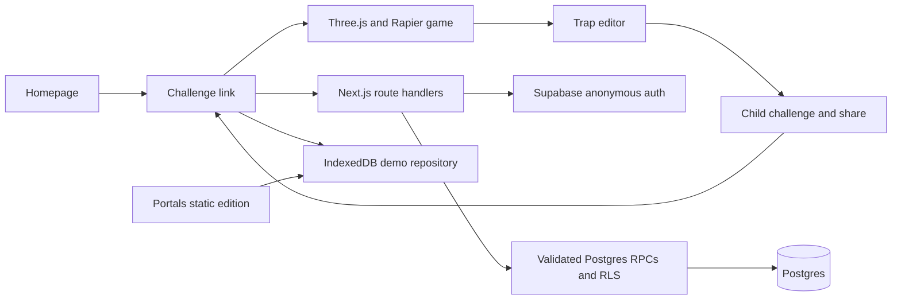

# MAKE IT WORSE

MAKE IT WORSE is a Three.js obstacle game: finish the apartment run, add one
legal trap, and pass the resulting challenge onward.

The repository contains two deployment targets:

- The Next.js application at the repository root supports the complete
  Supabase-backed, cross-device challenge loop.
- `portals/` is a static Vite edition for Portals. It carries no Supabase or
  API dependency, so challenge chains stay in that browser unless a complete
  code is shared. Portals supplies the global leaderboard and a bounded
  same-session map relay through its SDK; neither is a global UGC database.



The game ships seven modified CC BY 4.0 Sketchfab props plus an original brand-safe angry vacuum. Blender normalizes
their scale and ground origins, glTF Transform reduces browser delivery weight,
and authored Rapier primitives provide predictable gameplay collision. Full
attribution and normalized-file hashes are in
`public/assets/models/LICENSES.md`.

## Local development

Requirements: Node.js 20 or newer and pnpm.

```powershell
pnpm install --frozen-lockfile
Copy-Item .env.example .env.local
pnpm dev
```

With the Supabase values blank, the Next.js application uses its IndexedDB demo
repository. Open `http://localhost:3000`.

Run the release checks with:

```powershell
pnpm lint
pnpm typecheck
pnpm test
pnpm test:e2e
pnpm build
pnpm --filter @make-it-worse/portals build
pnpm verify:portals
```

`pnpm verify:custom-maps` is the real deployed-backend matrix. It intentionally
requires two different ordinary Supabase user tokens and a moderator token; see
`CUSTOM-GAME-SHARING.md` for the environment variables and exact coverage.

## Supabase production setup

1. Create a Supabase project and enable anonymous sign-ins.
2. Apply every SQL file in `supabase/migrations/` in filename order. For a
   linked Supabase CLI project, use `supabase db push`; otherwise apply the
   files in the SQL editor and record the applied versions.
3. Copy `.env.example` to `.env.local` and set:

   - `NEXT_PUBLIC_SITE_URL` to the canonical HTTPS origin.
   - `NEXT_PUBLIC_SUPABASE_URL` to the project URL.
   - `NEXT_PUBLIC_SUPABASE_PUBLISHABLE_KEY` to the publishable/anon key.
   - `NEXT_PUBLIC_BUILD_VERSION` to the release identifier.

Never put the Supabase service-role key in a `NEXT_PUBLIC_*` variable or in
this repository. The application intentionally uses anonymous Supabase users
and server-owned SECURITY DEFINER mutations.

Before production traffic, apply the migrations to a disposable project and
verify the following with anon and authenticated roles:

- direct updates to `profiles` and direct selects from `challenges` fail;
- `challenge_dto`, `refresh_challenge_payload`, and validation helpers cannot
  be invoked through the Data API;
- `get_public_challenge` returns only active, published payloads;
- completed attempts reject implausible durations and malformed ghost frames;
- share tokens contain only lowercase hexadecimal characters.
- direct custom-map table access fails, private maps never browse publicly,
  unlisted maps load only by exact id, and old immutable versions still load;
- publishing a stale custom-map version returns a conflict, three distinct
  reports quarantine it, and only a moderator can restore or reject it.

Migration `0021_custom_map_publishing.sql` powers `/maps` and `/api/maps/**`.
Do not describe that browser as global until this migration is applied to the
configured project. With Supabase unset, the page deliberately renders an
unavailable explanation instead of relabeling local IndexedDB maps.

The repository does not currently integrate a CAPTCHA widget. If CAPTCHA is
enabled for anonymous sign-in in Supabase, add a client challenge flow and pass
its token to `signInAnonymously` before enabling it for production.

## Trap audio

`public/audio/CREDITS.json` is the source-of-truth provenance manifest. Every
trap that reports an audio contact has a recording; Pixabay-derived files retain
their source/search URL, title, author, original filename, license, and processing
note. Raw browser downloads live in the ignored `sound effects/` folder.

To reproduce the 2026-07-29 cuts from those raw downloads:

```powershell
pnpm import:pixabay-audio
```

The importer creates 44.1 kHz stereo MP3 excerpts and crossfades the seams of
continuous beds. Rebuild `portals/dist` afterward so the static edition receives
the regenerated audio files.

## Portals build and import

Build the static edition locally first:

```powershell
pnpm --filter @make-it-worse/portals build
```

The output is `portals/dist/`. Its `index.html` and asset URLs are relative so
the game can run under Portals' versioned path. The title shell is kept separate
from the Three/Rapier game payload so the menu can paint before the course loads.

The GitHub import at `https://portals.to/my-games` serves the game folder as
static files without running a build (verified 2026-07-29: pointing it at
`portals` deployed the raw Vite source `index.html`, whose `/src/main.tsx`
module script no browser executes, so the preview rendered blank). The built
`portals/dist/` is therefore committed to Git, and the import settings are:

- game folder: `portals/dist`
- entry file: `index.html`

Choose the **Static** `portals/dist` directory in the source picker. Do not
choose the Vite project or any `assets/reference/**/preview` directory. The
reference pipeline is export-ignored and is not a deployable game bundle.

Portals sync is manual. After changing game code: rebuild
(`pnpm --filter @make-it-worse/portals build`), commit `portals/dist`, push,
then re-sync from the Portals editor. The repository's `.gitattributes` marks
`assets/` export-ignore to keep the snapshot Portals downloads under its
archive size limit (147 MB failed with SOURCE_ARCHIVE_FAILED; ~7 MB works).

The Portals edition must remain self-contained: no external `fetch`, Supabase,
font, analytics, or CDN dependency can be required at runtime. Clipboard access
may also be denied by the embedding iframe, so copying must always have a
visible fallback.

## Global leaderboard

`portals/src/leaderboard.ts` adapts the [Portals
SDK](https://portals.to/documentation/advanced-tooling/portals-sdk) to the
game's fastest-clear board. Three properties of that SDK shape the design:

- Portals hosts the managed `./_portals/sdk.js` resource in every processed
  preview and published bundle. `portals/index.html` loads that managed path
  before the application module; the runtime is absent under `pnpm --filter
  @make-it-worse/portals dev`. Never vendor or commit that file. Every call
  feature-detects `window.Portals` and returns an `unavailable` status the
  interface renders as an explanation.
- The SDK ranks higher scores first, but a faster clear is a better clear. A
  completed run always finishes inside `ATTEMPT_LIMIT_MS`, so the adapter
  submits the milliseconds remaining and converts back for display.
- Scores are grouped by `mode`. The board uses `depth-<n>`, because every
  player at a given chain depth ran the same number of traps, while chain slugs
  in this edition are local to one browser and would never collect a second
  player.

Submitting requires sign-in, so `Portals.identity.requestLogin()` is wired to a
button rather than an effect, as the SDK requires. Scores are client-reported
and carry no entitlement, matching the SDK's guidance and the same
client-authoritative caveat that applies to attempt completion.

For a bounded frame-time sample against a focused local or hosted game URL, run
`pnpm measure:portals -- <url> [width] [height]`. Headless SwiftShader results are
diagnostic only; acceptance measurements must come from a foreground, GPU-backed
browser at the target resolution.

## Repository hygiene

`.env.example` is intentionally committed; all other `.env*` files are ignored.
Generated Next.js/test artifacts and the local `miw-scaffold/` dependency tree
are ignored. Do not initialize or publish a repository until the full check
sequence above is green and the staged file list has been reviewed.
