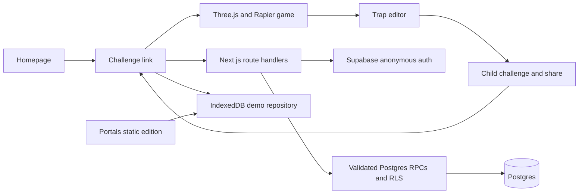

# MAKE IT WORSE

MAKE IT WORSE is a Three.js obstacle game: finish the apartment run, add one
legal trap, and pass the resulting challenge onward.

The repository contains two deployment targets:

- The Next.js application at the repository root supports the complete
  Supabase-backed, cross-device challenge loop.
- `portals/` is a static Vite edition for Portals. Portals' game sandbox does
  not allow the external Supabase/API connections used by the full service, so
  this edition stores chains in that browser only. It must not be described as
  cross-device multiplayer.



The game ships seven modified CC BY 4.0 Sketchfab props plus an original brand-safe angry vacuum. Blender normalizes
their scale and ground origins, glTF Transform reduces browser delivery weight,
and authored Rapier primitives provide predictable gameplay collision. Full
attribution and normalized-file hashes are in
`public/assets/models/LICENSES.md`.

## Local development

Requirements: Node.js 20 or newer and pnpm.

```powershell
pnpm install --frozen-lockfile
Copy-Item .env.example .env.local
pnpm dev
```

With the Supabase values blank, the Next.js application uses its IndexedDB demo
repository. Open `http://localhost:3000`.

Run the release checks with:

```powershell
pnpm lint
pnpm typecheck
pnpm test
pnpm test:e2e
pnpm build
pnpm --filter @make-it-worse/portals build
```

## Supabase production setup

1. Create a Supabase project and enable anonymous sign-ins.
2. Apply every SQL file in `supabase/migrations/` in filename order. For a
   linked Supabase CLI project, use `supabase db push`; otherwise apply the
   files in the SQL editor and record the applied versions.
3. Copy `.env.example` to `.env.local` and set:

   - `NEXT_PUBLIC_SITE_URL` to the canonical HTTPS origin.
   - `NEXT_PUBLIC_SUPABASE_URL` to the project URL.
   - `NEXT_PUBLIC_SUPABASE_PUBLISHABLE_KEY` to the publishable/anon key.
   - `NEXT_PUBLIC_BUILD_VERSION` to the release identifier.

Never put the Supabase service-role key in a `NEXT_PUBLIC_*` variable or in
this repository. The application intentionally uses anonymous Supabase users
and server-owned SECURITY DEFINER mutations.

Before production traffic, apply the migrations to a disposable project and
verify the following with anon and authenticated roles:

- direct updates to `profiles` and direct selects from `challenges` fail;
- `challenge_dto`, `refresh_challenge_payload`, and validation helpers cannot
  be invoked through the Data API;
- `get_public_challenge` returns only active, published payloads;
- completed attempts reject implausible durations and malformed ghost frames;
- share tokens contain only lowercase hexadecimal characters.

The repository does not currently integrate a CAPTCHA widget. If CAPTCHA is
enabled for anonymous sign-in in Supabase, add a client challenge flow and pass
its token to `signInAnonymously` before enabling it for production.

## Portals build and import

Build the static edition locally first:

```powershell
pnpm --filter @make-it-worse/portals build
```

The output is `portals/dist/`. Its `index.html` and asset URLs are relative so
the game can run under Portals' versioned path.

For a GitHub import at `https://portals.to/my-games`, select the repository and
use these advanced settings:

- build mode: Vite
- project directory: `portals`
- install command: `pnpm install --frozen-lockfile`
- build command: `pnpm build`
- output directory: `dist`

If the importer cannot resolve the workspace lockfile, build locally and upload
the generated `portals/dist` directory through Portals' static/ZIP workflow;
the generated directory is intentionally not committed to Git. Portals sync is
manual, so re-sync the game after future GitHub updates.

The Portals edition must remain self-contained: no external `fetch`, Supabase,
font, analytics, or CDN dependency can be required at runtime. Clipboard access
may also be denied by the embedding iframe, so copying must always have a
visible fallback.

## Repository hygiene

`.env.example` is intentionally committed; all other `.env*` files are ignored.
Generated Next.js/test artifacts and the local `miw-scaffold/` dependency tree
are ignored. Do not initialize or publish a repository until the full check
sequence above is green and the staged file list has been reviewed.
